# 📘 Todoaw — Product Bible

![Todoaw Logo Placeholder]

> **Atur hidupmu, tanpa ribet.**

| | |
|---|---|
| **Versi Dokumen** | 1.0.0 |
| **Tanggal** | Juli 2026 |
| **Author** | Tim Produk Todoaw |
| **Status** | ✅ Final |
| **Lisensi** | MIT |

---

## Daftar Isi

- [📘 Todoaw — Product Bible](#-todoaw--product-bible)
  - [Daftar Isi](#daftar-isi)
  - [1. Product Vision](#1-product-vision)
  - [2. Product Mission](#2-product-mission)
  - [3. Product Philosophy](#3-product-philosophy)
  - [4. Core Values](#4-core-values)
  - [5. Target User](#5-target-user)
  - [6. User Journey](#6-user-journey)
  - [7. Product Positioning](#7-product-positioning)
  - [8. Product Identity](#8-product-identity)
  - [9. UX Principles](#9-ux-principles)
  - [10. UI Principles](#10-ui-principles)
  - [11. Design Language](#11-design-language)
  - [12. Visual Design System](#12-visual-design-system)
  - [13. Component Rules](#13-component-rules)
  - [14. Screen Principles](#14-screen-principles)
  - [15. Product Features](#15-product-features)
  - [16. Roadmap](#16-roadmap)
  - [17. Feature Priority (MoSCoW)](#17-feature-priority-moscow)
  - [18. Technical Principles](#18-technical-principles)
  - [19. Coding Principles](#19-coding-principles)
  - [20. Accessibility](#20-accessibility)
  - [21. Performance Standard](#21-performance-standard)
  - [22. Security](#22-security)
  - [23. Definition of Done](#23-definition-of-done)
  - [24. Anti Patterns](#24-anti-patterns)
  - [25. Future Vision (5 Tahun)](#25-future-vision-5-tahun)
  - [26. Guideline untuk AI Agent](#26-guideline-untuk-ai-agent)

---

## 1. Product Vision

### Visi Besar

> **Todoaw adalah Calm Productivity companion untuk Asia Tenggara — membantu kamu mengatur hidup dengan cara sendiri, dalam bahasamu sendiri, tanpa kebisingan.**

### Masalah yang Diselesaikan

| Masalah | Dampak | Solusi Todoaw |
|---------|--------|---------------|
| Aplikasi produktivitas luar negeri dingin, tidak relevan dengan budaya Indonesia | User merasa asing, cepat abandon | Bahasa Indonesia sebagai first-class citizen, budaya "besok" dan "insyaAllah" diakomodasi |
| Notifikasi agresif membuat stress | User burnout, justru makin tidak produktif | "Mode Santai" — sembunyikan deadline, streak, statistik |
| Aplikasi bagus berbayar, mahal | User Indonesia tidak bisa akses | FOSS, gratis selamanya, data lokal |
| Task manager luar negeri tidak mengerti fleksibilitas waktu Indonesia | Deadline terlalu kaku | Mood-based scheduling, "besok insyaAllah" |
| Data pribadi dikirim ke cloud asing | Privasi terancam | Offline-first, 100% data di device |

### Mengapa Todoaw Dibuat?

Aplikasi produktivitas yang ada saat ini dirancang oleh dan untuk budaya Barat. Mereka mengasumsikan:
- Hari kerja 9-to-5 yang ketat
- Deadline yang rigid
- Bahasa Inggris sebagai default
- Subscription $5-10/bulan adalah normal
- Cloud sync adalah suatu keharusan

Todoaw hadir karena asumsi itu tidak selalu cocok untuk Indonesia dan Asia Tenggara.

Kami percaya produktivitas tidak harus mahal, tidak harus berbahasa Inggris, dan tidak harus membuat stress.

---

## 2. Product Mission

### Misi Kami

1. **Menjadi task manager #1 di Indonesia** — Bukan dengan meniru kompetitor, tetapi dengan memahami budaya lokal.
2. **Contoh produk open source yang bersaing dengan produk komersial** — Membuktikan bahwa FOSS bisa punya kualitas desain dan UX kelas dunia.
3. **Membangun budaya "Calm Productivity"** — Di era notifikasi berlebihan, Todoaw menjadi oase.

### Nilai yang Diberikan

| Untuk | Nilai |
|-------|-------|
| **Mahasiswa** | Gratis, bahasa Indonesia, tracking tugas kuliah + habit belajar |
| **Freelancer** | Manajemen proyek ringan, focus timer, catatan klien |
| **Pegawai** | Task harian, meeting notes, prioritas pekerjaan |
| **Pebisnis** | Gambaran besar via dashboard, streak konsistensi |
| **Siapa pun** | Ketenangan — produktivitas tanpa stress |

### Janji Kami ke Pengguna

> "Kami tidak akan menjual data kamu. Kami tidak akan mengunci fitur di balik paywall. Kami tidak akan membuat kamu merasa bersalah karena tidak menyelesaikan semua task hari ini."

---

## 3. Product Philosophy

### 3.1 Calm Productivity

Bukan "grind harder." Bukan "hustle culture." Todoaw percaya bahwa produktivitas sejati datang dari ketenangan, bukan tekanan.

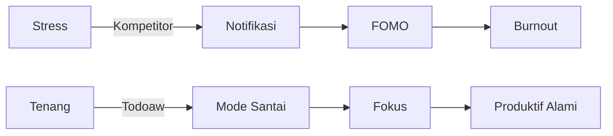

### 3.2 Offline First

Todoaw tidak membutuhkan internet. Semua data disimpan di SQLite lokal. Sinkronisasi adalah fitur tambahan, bukan kebutuhan dasar.

Ini penting untuk Indonesia di mana koneksi internet tidak selalu stabil.

### 3.3 Privacy First

Tidak ada akun. Tidak ada cloud. Tidak ada tracking. Data Anda, di device Anda.

### 3.4 Fast by Default

Setiap interaksi harus terasa instan. Tidak ada loading spinner yang tidak perlu. Tidak ada animasi yang memperlambat.

### 3.5 Simple, Not Simplistic

Sederhana bukan berarti kurang fitur. Berarti fitur yang ada mudah ditemukan dan digunakan.

Contoh: Task form memiliki prioritas, kategori, deadline, recurring — tapi semua muncul secara alami, bukan dalam satu halaman penuh form.

### 3.6 Beautiful, Not Flashy

Desain yang indah tidak perlu ramai. Todoaw menggunakan whitespace, tipografi yang baik, dan warna yang tenang.

### 3.7 Focus

Satu screen, satu tujuan. Tidak ada sidebar yang penuh dengan 10 menu berbeda.

### 3.8 Intentional Design

Setiap pixel punya alasan. Tidak ada dekorasi tanpa fungsi. Tidak ada animasi tanpa tujuan.

### 3.9 Natural Interaction

Interaksi harus terasa alami — seperti menyentuh kertas, bukan seperti mengoperasikan mesin.

Contoh: Drag handle di bottom sheet, checkbox melingkar yang memuaskan saat di-tap.

### 3.10 Modular

Pengguna bisa memilih fitur yang mereka butuhkan. Tidak suka habit tracker? Matikan. Hanya perlu notes? Bisa.

---

## 4. Core Values

| # | Nilai | Penjelasan | Contoh Implementasi |
|---|-------|------------|-------------------|
| 1 | **Simplicity** | Sesederhana mungkin, tidak kurang dari itu | Task form hanya 1 sheet, bukan multi-step wizard |
| 2 | **Consistency** | Pola yang sama di seluruh aplikasi | Semua card pakai radius yang sama, semua bottom sheet pakai drag handle |
| 3 | **Accessibility** | Untuk semua orang | Font besar, kontras tinggi, touch target min 48px |
| 4 | **Speed** | Cepat secara default | Tidak ada splash screen delay (hanya 2 detik branding) |
| 5 | **Privacy** | Data milik user | 100% lokal, tidak ada API call ke server |
| 6 | **Offline** | Bekerja tanpa internet | SQLite lokal, tidak ada cloud dependency |
| 7 | **User First** | Semua keputusan berdasar kebutuhan user | Fitur "Mode Santai" dari feedback user burnout |
| 8 | **Minimalism** | Hanya yang esensial | Tidak ada onboarding yang panjang, langsung ke home |
| 9 | **Calm Design** | Tenang, tidak berteriak | Warna primary tidak agresif, notifikasi minimal |
| 10 | **Maintainability** | Kode bersih, dokumentasi baik | Riverpod + Clean Architecture, 172+ test |
| 11 | **Local First** | Bahasa dan budaya Indonesia | Greeting "Selamat Pagi", hari/bulan Indonesia |
| 12 | **Transparency** | Open source, tidak ada hidden agenda | Semua kode publik di GitHub, MIT license |

---

## 5. Target User

### 5.1 Persona: Rina — Mahasiswa

| Atribut | Detail |
|---------|--------|
| **Usia** | 20 tahun |
| **Pekerjaan** | Mahasiswa semester 5 |
| **Device** | Android mid-range (Xiaomi/Realme/Oppo) |
| **Literasi Teknologi** | Medium — bisa pakai social media, tidak familiar dengan productivity tools |
| **Goals** | Mengatur deadline tugas kuliah, tracking habit belajar, tidak keteteran UTS/UAS |
| **Pain Points** | Sering lupa deadline, stress dengan banyak tugas, aplikasi luar negeri ribet |
| **Motivation** | IPK bagus, lulus tepat waktu |
| **Behaviour** | Sering menunda, pakai HP terus, lebih suka voice note daripada ngetik |

### 5.2 Persona: Dimas — Programmer Freelancer

| Atribut | Detail |
|---------|--------|
| **Usia** | 28 tahun |
| **Pekerjaan** | Full-stack developer freelance |
| **Device** | Android flagship + Windows laptop |
| **Literasi Teknologi** | Tinggi — familiar dengan Git, CLI, productivity tools |
| **Goals** | Mengatur 3-4 proyek freelance, tracking billable hours, fokus tanpa distraksi |
| **Pain Points** | Overwhelm dengan banyak proyek, sulit estimasi waktu, sering lembur |
| **Motivation** | Pendapatan stabil, work-life balance |
| **Behaviour** | Pakai Pomodoro, suka data dan statistik, butuh offline mode |

### 5.3 Persona: Sari — Pegawai Kantoran

| Atribut | Detail |
|---------|--------|
| **Usia** | 32 tahun |
| **Pekerjaan** | Marketing manager |
| **Device** | Android + MacBook kantor |
| **Literasi Teknologi** | Medium |
| **Goals** | Daily task management, meeting notes, team coordination ringan |
| **Pain Points** | Meeting bertubi-tubi, lupa follow-up, task campur aduk antara kerja dan pribadi |
| **Motivation** | Naik jabatan, terlihat kompeten |
| **Behaviour** | Suka checklist, sering pakai sticky notes |

### 5.4 Persona: Budi — Pebisnis UMKM

| Atribut | Detail |
|---------|--------|
| **Usia** | 45 tahun |
| **Pekerjaan** | Pemilik toko online |
| **Device** | Android entry-level |
| **Literasi Teknologi** | Rendah |
| **Goals** | Mencatat pesanan, jadwal kirim, utang-piutang |
| **Pain Points** | Aplikasi terlalu kompleks, bingung dengan fitur, tulisan terlalu kecil |
| **Motivation** | Usaha maju, pelanggan puas |
| **Behaviour** | Jarang update aplikasi, butuh font besar, lebih suka icon dari text |

### 5.5 Persona: Alya — Content Creator

| Atribut | Detail |
|---------|--------|
| **Usia** | 24 tahun |
| **Pekerjaan** | YouTuber / TikToker |
| **Device** | iPhone + Android (dual) |
| **Literasi Teknologi** | Medium-high |
| **Goals** | Ide konten, jadwal upload, tracking habit konsisten |
| **Pain Points** | Sering kehabisan ide, deadline upload tidak konsisten, burnout |
| **Motivation** | Growth channel, 100K subscribers |
| **Behaviour** | Suka voice memo, aesthetic, mobile-first |

---

## 6. User Journey

### 6.1 Pertama Install

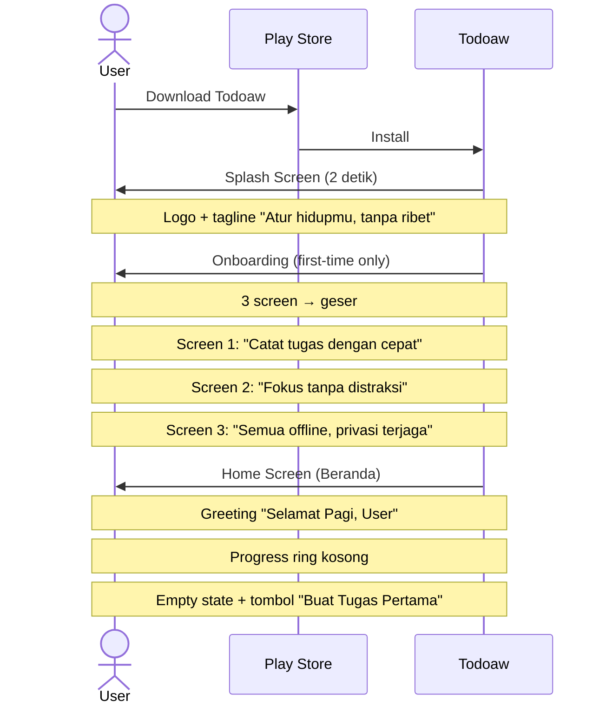

### 6.2 Membuat Tugas

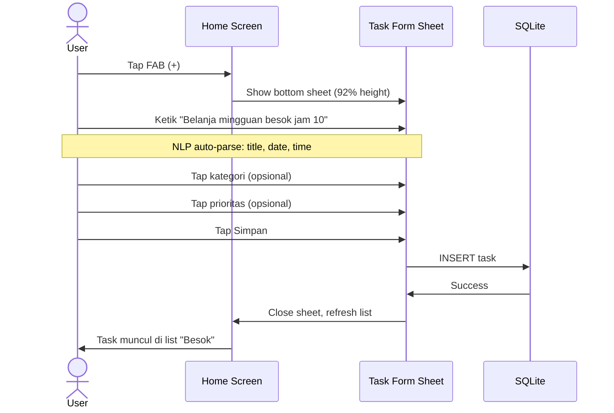

### 6.3 Mengelola Tugas

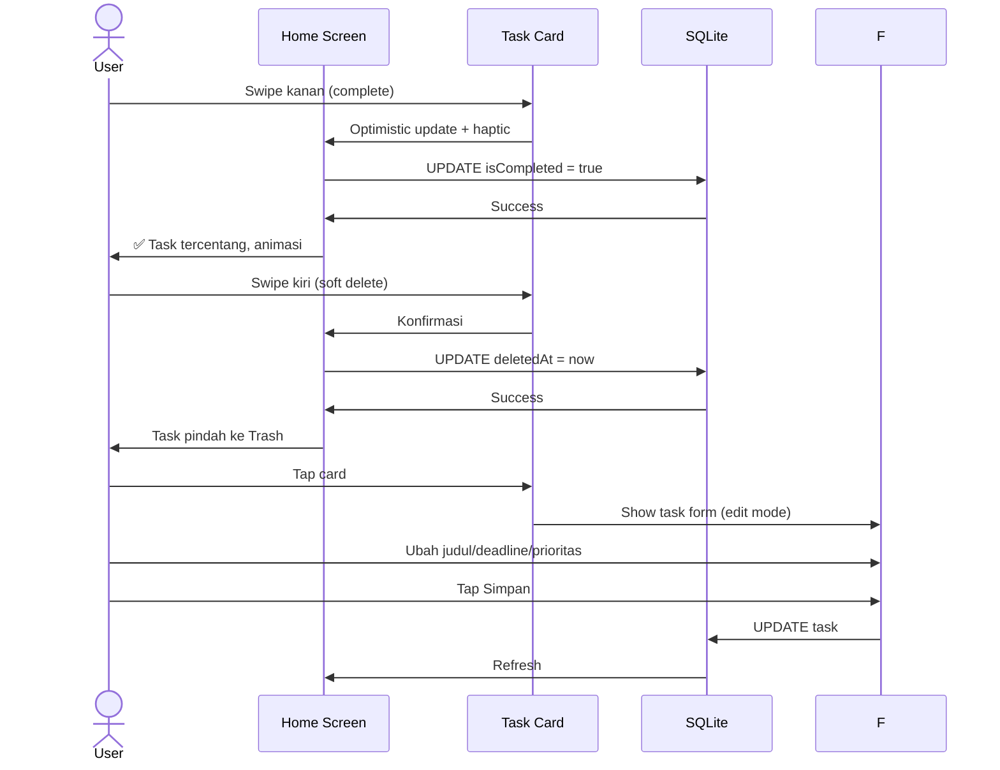

### 6.4 Focus Mode

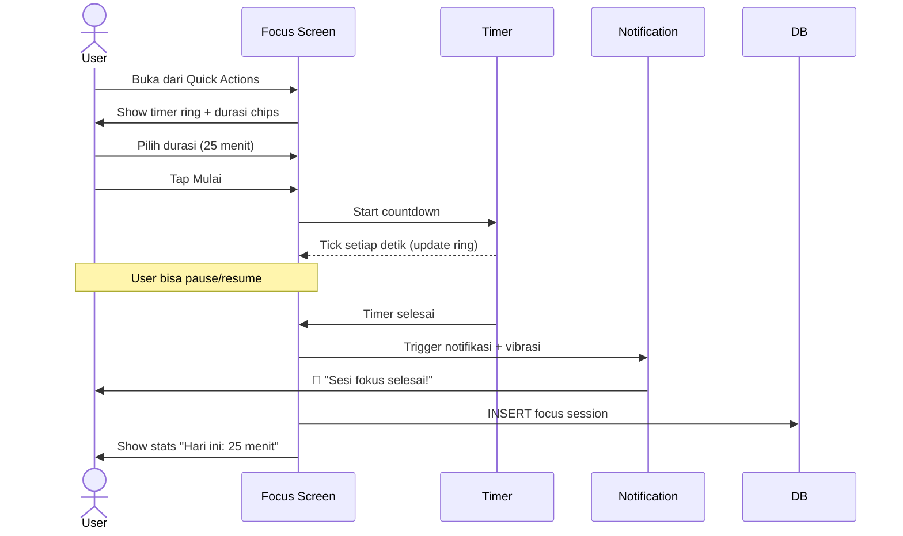

### 6.5 Mengelola Habits

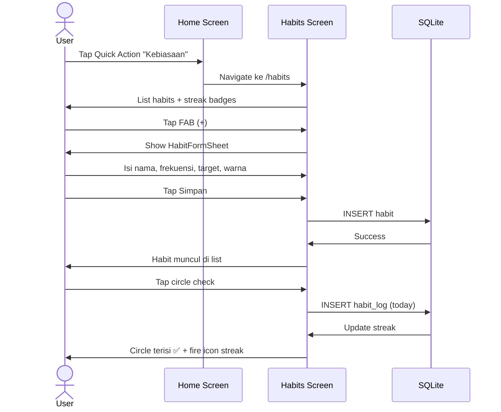

### 6.6 Mengelola Notes

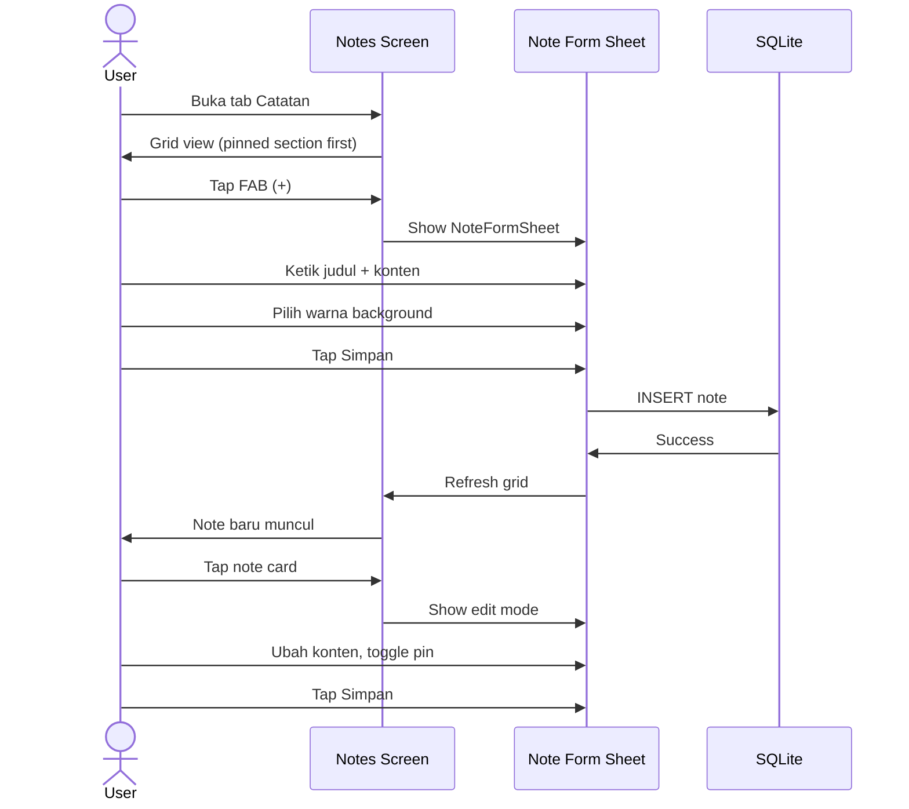

### 6.7 Backup Data

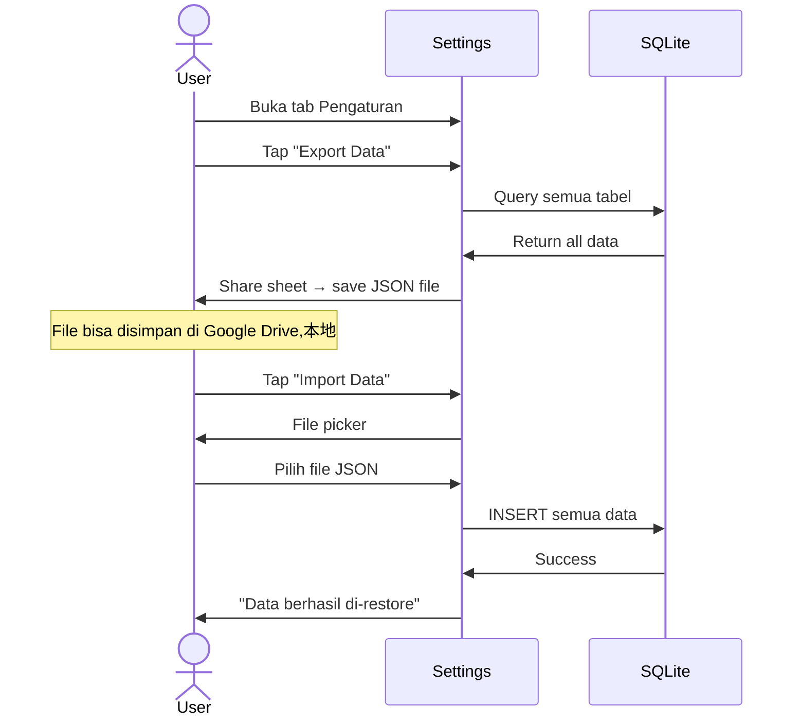

---

## 7. Product Positioning

### 7.1 Competitive Matrix

| Kriteria | Todoaw | TickTick | Todoist | Things 3 | MS To Do | Google Tasks |
|----------|--------|----------|---------|----------|----------|--------------|
| **Gratis** | ✅ Full | ✅ Terbatas | ✅ 5 proyek | ❌ $80 | ✅ Full | ✅ Full |
| **Open Source** | ✅ | ❌ | ❌ | ❌ | ❌ | ❌ |
| **Offline First** | ✅ | ✅ | ❌ | ✅ | ✅ | ❌ |
| **Bahasa Indonesia** | ✅⭐ | ❌ | ❌ | ❌ | ❌ | ❌ |
| **Habit Tracker** | ✅ | ✅⭐ | ❌ | ❌ | ❌ | ❌ |
| **Focus Timer** | ✅ | ✅⭐ | ❌ | ❌ | ❌ | ❌ |
| **Notes** | ✅ | ✅ | ✅ | ✅ | ❌ | ❌ |
| **Calendar** | ✅ | ✅⭐ | ✅ Pro | ❌ | ❌ | ❌ |
| **Mode Santai** | ✅⭐ | ❌ | ❌ | ❌ | ❌ | ❌ |
| **Mood Tracking** | 🔜 | ❌ | ❌ | ❌ | ❌ | ❌ |
| **Sheets Integration** | ❌ | ❌ | ❌ | ❌ | ✅ | ✅ Gmail |
| **NLP / Smart Parse** | 🔜 | ✅ | ✅⭐ | ✅ | ❌ | ❌ |
| **Collaboration** | ❌ | ✅ | ✅ | ❌ | ✅ | ✅ |
| **Cross-platform** | 🔜 Android only | ✅ Semua | ✅ Semua | ❌ Apple | ✅ MS | ✅ Web |

### 7.2 Kelebihan Todoaw

1. **Gratis total + open source** — Tidak ada fitur yang di-lock. Todoist/Things 3 butuh bayar untuk fitur dasar.
2. **Bahasa Indonesia native** — Bukan hasil Google Translate. Greeting, hari, bulan, frase semuanya natural.
3. **Calm Productivity** — Tidak seperti TickTick yang ramai, Todoaw fokus pada ketenangan.
4. **Offline-first** — Bekerja tanpa internet, berbeda dengan Google Tasks yang cloud-dependent.
5. **Modular** — Tidak seperti TickTick yang memaksa semua fitur, Todoaw bisa dikustomisasi.

### 7.3 Kekurangan Todoaw (Saat Ini)

1. **Android only** — Belum tersedia di iOS/Windows/Web (TickTick & Todoist sudah cross-platform)
2. **Tidak ada NLP** — Input task masih manual (Todoist unggul di sini)
3. **Tidak ada collaboration** — Tidak bisa share task (MS To Do & Todoist punya)
4. **Ekosistem kecil** — Tidak ada integrasi dengan Google Calendar, Slack, dll.
5. **UI belum semewah Things 3** — Things 3 adalah gold standard desain task manager

### 7.4 Peluang Todoaw

1. **Pasar Indonesia besar** — 200M+ smartphone users, tidak ada task manager lokal yang dominant
2. **Subscription fatigue** — Semakin banyak orang mencari alternatif FOSS
3. **Privacy awareness** — Orang mulai sadar data mereka berharga
4. **Calm Productivity trend** — Orang mulai meninggalkan hustle culture
5. **Flutter ecosystem** — Satu codebase untuk Android, iOS, Web, Windows, macOS

### 7.5 Keunikan Todoaw (Tidak Bisa Ditiru Mudah)

| Keunikan | Mengapa Sulit Ditiru |
|----------|---------------------|
| Bahasa Indonesia asli | Butuh native speaker, bukan cuma translate |
| Calm Productivity DNA | Filosofi yang melekat di setiap keputusan desain |
| FOSS + Full features | Kompetitor harus memonetisasi |
| Mode Santai | Berbeda dari filosofi kompetitor yang push notifikasi |
| Mood + Energy tracking | Data unik yang tidak dimiliki task manager lain |

---

## 8. Product Identity

### 8.1 Brand Personality

Jika Todoaw adalah manusia, dia adalah:

> **Seorang teman yang tenang, bijaksana, dan tidak judgmental.**
> 
> Dia tidak pernah membangunkan kamu jam 3 pagi untuk mengingatkan deadline.
> Dia tidak membuat kamu merasa bersalah karena tugas tidak selesai.
> Dia hanya berkata, "Santai, kita kerjakan satu per satu."
> 
> Dia profesional tapi tidak kaku.
> Dia terorganisir tapi tidak perfeksionis.
> Dia membantu tapi tidak menggurui.

### 8.2 Tone & Voice

| Dimensi | Karakteristik |
|---------|---------------|
| **Tone** | Hangat, profesional, tidak formal berlebihan |
| **Voice** | Seperti teman yang membantu, bukan bos yang memerintah |
| **Feeling** | Tenang, aman, terkontrol |
| **Emotion** | Lega, fokus, puas |
| **Kata ganti** | "Kamu" (bukan "Anda") |
| **Humor** | Jarang, tapi hangat kalau ada |

### 8.3 Contoh Voice

| Konteks | Todoaw | Kompetitor (Todoist) |
|---------|--------|---------------------|
| **Empty state** | "Belum ada tugas hari ini. Santai dulu." | "No tasks. Add your first task." |
| **Semua selesai** | "Mantap! Semua beres. Istirahat yang layak." | "You've completed all tasks! +100 Karma" |
| **Streak** | "Keren, 5 hari berturut-turut! Keep it up." | "5-day streak! 🔥 You're on fire!" |
| **Error** | "Waduh, ada yang error. Coba lagi ya." | "An error occurred. Please try again." |
| **Onboarding** | "Todoaw bantu kamu atur hidup, tanpa ribet." | "Get organized, stay productive." |

### 8.4 Visual Identity

| Elemen | Karakteristik |
|--------|---------------|
| **Warna** | Lembut, tidak mencolok. Primary #5865F2 (biru tenang) |
| **Typography** | Plus Jakarta Sans — modern, hangat, mendukung Latin + Bahasa Indonesia |
| **Shape** | Rounded corner 16px — ramah, tidak tajam |
| **Icon** | Outline, thin weight — minimalis |
| **Motion** | Lambat, smooth, natural — tidak menyentak |
| **Spacing** | Luas — memberi ruang untuk bernafas |
| **Elevation** | Rendah — tidak berlebihan |

### 8.5 Brand Spectrum

```
Kaku ←-----------------------→ Santai
  Enterprise                    Todoaw
  Todoist

Formal ←-----------------------→ Casual
  Things 3                      Todoaw
  MS To Do

Ramai ←------------------------→ Minimal
  TickTick                      Todoaw
                                Things 3

Mahal ←------------------------→ Gratis
  Todoist $48/thn               Todoaw
  Things 3 $80

Global ←------------------------→ Lokal
  Todoist                       Todoaw
  TickTick

Push ←--------------------------→ Tenang
  TickTick alarm                 Todoaw Mode Santai
  Todoist notifikasi
```

---

## 9. UX Principles

### 9.1 25 Prinsip UX Todoaw

| # | Prinsip | Penjelasan | Contoh |
|---|---------|------------|--------|
| 1 | **Never surprise users** | Semua aksi harus bisa diprediksi | Tombol simpan selalu di kanan atas |
| 2 | **Reduce friction** | Semakin sedikit tap, semakin baik | FAB langsung buka form, tidak perlu menu |
| 3 | **One hand usage** | Semua interaksi dalam jangkauan thumb | Bottom navigation + bottom sheet |
| 4 | **Fast interaction** | Tidak ada loading yang tidak perlu | Optimistic update: UI berubah sebelum API selesai |
| 5 | **Less tap** | Maksimal 3 tap untuk aksi utama | Task bisa di-complete dengan 1 tap (checkbox) |
| 6 | **Natural motion** | Animasi harus terasa seperti fisika nyata | Bottom sheet drag mengikuti jari |
| 7 | **Large touch target** | Minimal 48px untuk semua interaktif | FAB 56px, chip minimal 32px |
| 8 | **Clear hierarchy** | User harus tahu apa yang penting | Header > Card > List |
| 9 | **Accessibility** | Tidak boleh ada yang tertinggal | Font bisa diperbesar, kontras cukup |
| 10 | **Forgiving input** | User boleh salah, ada undo | Soft delete → trash, bukan permanent |
| 11 | **Consistent behavior** | Tombol yang sama = perilaku yang sama | Semua FAB = create |
| 12 | **Visual feedback** | Setiap aksi harus ada respons | Haptic pada toggle, animasi pada check |
| 13 | **Progressive disclosure** | Fitur kompleks disembunyikan sampai dibutuhkan | Recurring picker hanya muncul jika tap |
| 14 | **Offline resilience** | Aplikasi harus berfungsi penuh tanpa internet | Semua fitur bekerja offline |
| 15 | **Contextual help** | Bantuan relevan dengan konteks | Empty state menjelaskan apa yang harus dilakukan |
| 16 | **Error prevention** | Cegah error sebelum terjadi | Validasi title task tidak boleh kosong |
| 17 | **Recovery** | Error harus mudah dipulihkan | Undo delete, trash dengan restore |
| 18 | **User control** | User yang memegang kendali | "Mode Santai" bisa di-toggle kapan saja |
| 19 | **Familiar patterns** | Gunakan pola yang sudah dikenal | Bottom navigation, swipe gesture |
| 20 | **Meaningful empty states** | Tidak boleh "No data" kosong | Ilustrasi + saran aksi |
| 21 | **Confidence before speed** | Jangan korbankan clarity demi kecepatan | Form tetap ada label meskipun minimal |
| 22 | **Prevent cognitive overload** | Jangan tampilkan semua informasi sekaligus | Calendar hanya show bulan ini, agenda per hari |
| 23 | **Gestures discoverability** | Gesture harus bisa ditemukan | Swipe hint di TaskCard pertama kali |
| 24 | **Privacy by default** | Privasi adalah default, bukan opt-in | Tidak ada data yang dikirim ke server |
| 25 | **Joyful micro-interactions** | Momen kecil yang membuat senyum | Streak fire icon, progress ring animasi |

---

## 10. UI Principles

### 10.1 25 Prinsip UI Todoaw

| # | Prinsip | Spesifikasi |
|---|---------|-------------|
| 1 | **Whitespace** | Minimum 16px padding di semua screen, 24px untuk premium |
| 2 | **Typography hierarchy** | Headline (32px) > Title (20px) > Body (14px) > Caption (12px) |
| 3 | **Color limit** | Maksimal 3 warna per screen: primary, surface, accent |
| 4 | **Radius consistency** | Card = 16px, Button = 12px, Chip = 8px, Circular = 50% |
| 5 | **Icon weight** | Outlined untuk inactive, filled untuk active/selected |
| 6 | **Elevation limit** | 3 level: resting (0dp), card (2dp), modal (8dp) |
| 7 | **Animation duration** | 200ms default, 300ms untuk transition, 100ms untuk micro |
| 8 | **Grid system** | 4-column untuk mobile, 8-column untuk tablet |
| 9 | **Spacing scale** | 4-8-12-16-20-24-32-48-64 |
| 10 | **Dark mode** | Tidak boleh inverted — harus di-desain sendiri |
| 11 | **Touch target** | Minimum 48x48px untuk semua elemen interaktif |
| 12 | **Text contrast** | Minimum 4.5:1 untuk normal text, 3:1 untuk large text |
| 13 | **Line length** | Maksimal 80 karakter per baris untuk readability |
| 14 | **Focus indicator** | Visible focus ring untuk keyboard navigation |
| 15 | **Loading state** | Skeleton screen lebih baik dari spinner |
| 16 | **Error state** | Inline error, bukan dialog (kecuali fatal) |
| 17 | **Success state** | Animasi subtle, bukan pop-up |
| 18 | **Bottom sheet** | Drag handle 4px x 32px, rounded 16px |
| 19 | **List item height** | Minimum 56px untuk list tile, 72px untuk card |
| 20 | **Button height** | 48px default, 40px compact, 56px prominent |
| 21 | **Form field** | Label di luar field (floating), error inline |
| 22 | **Divider** | 1px, opacity 8%, bukan garis hitam solid |
| 23 | **Shadow** | Only use elevation, no custom box-shadow |
| 24 | **Gradient** | Subtle, hanya untuk highlight (hero header) |
| 25 | **Scrim** | Modal overlay 40% opacity, backdrop blur 4px |

---

## 11. Design Language

### 11.1 Karakter Desain

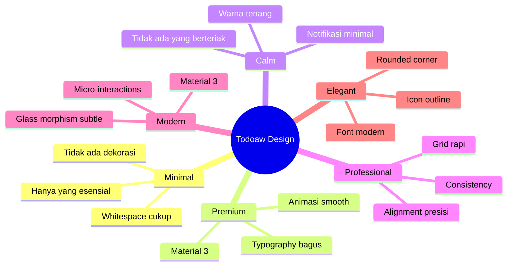

### 11.2 Bukan AI Slop

Todoaw tidak boleh terlihat seperti hasil generate AI.

Ciri AI Slop yang dihindari:
- ❌ Gradient warna-warni tidak konsisten
- ❌ Icon berbeda style dalam satu screen
- ❌ Padding tidak konsisten
- ❌ Typography campur aduk (3+ font)
- ❌ Shadow berlebihan
- ❌ Dekorasi tanpa fungsi
- ❌ Animasi yang tidak smooth
- ❌ Warna yang tidak harmonis

### 11.3 Bukan Template

Todoaw tidak boleh terasa seperti hasil copy-paste dari template.

- ❌ Tidak ada AppBar default di semua screen
- ❌ Tidak ada Card standar tanpa kustomisasi
- ❌ Tidak ada list monoton tanpa variasi
- ❌ Tidak ada icon default tanpa konteks

---

## 12. Visual Design System

### 12.1 Color Tokens

```dart
class ColorTokens {
  // Primary
  static const Color primary = Color(0xFF5865F2);     // Biru tenang
  static const Color primaryLight = Color(0xFF8B95F7);
  static const Color primaryDark = Color(0xFF3D4ADB);

  // Surface
  static const Color surface = Color(0xFFFFFFFF);      // Light
  static const Color surfaceVariant = Color(0xFFF3F4F6);
  static const Color darkSurface = Color(0xFF1E1E2E);
  static const Color darkBackground = Color(0xFF141420);

  // Semantic
  static const Color success = Color(0xFF10B981);      // Hijau
  static const Color warning = Color(0xFFF59E0B);      // Kuning
  static const Color danger = Color(0xFFEF4444);       // Merah
  static const Color info = Color(0xFF3B82F6);         // Biru

  // Neutral
  static const Color gray50 = Color(0xFFF9FAFB);
  static const Color gray100 = Color(0xFFF3F4F6);
  static const Color gray200 = Color(0xFFE5E7EB);
  static const Color gray300 = Color(0xFFD1D5DB);
  static const Color gray400 = Color(0xFF9CA3AF);
  static const Color gray500 = Color(0xFF6B7280);
  static const Color gray600 = Color(0xFF4B5563);
  static const Color gray700 = Color(0xFF374151);
  static const Color gray800 = Color(0xFF1F2937);
  static const Color gray900 = Color(0xFF111827);
}
```

### 12.2 Color Usage

| Elemen | Warna | Catatan |
|--------|-------|---------|
| **Background** | `surface` / `darkSurface` | Bergantung tema |
| **Card** | `surface` dengan elevation 2dp | Di atas background |
| **Primary button** | `primary` → white text | Konsisten di semua tombol |
| **Success** | `success` | Task selesai, streak |
| **Warning** | `warning` | Prioritas urgent, streak fire |
| **Danger** | `danger` | Delete, hapus permanent |
| **Info** | `info` | Link, informasi |
| **Text primary** | `gray900` / white | Kontras tinggi |
| **Text secondary** | `gray500` | Label, caption |
| **Text disabled** | `gray300` / opacity 30% | Non-aktif |

### 12.3 Typography

**Font Family:** Plus Jakarta Sans (Google Fonts)

```dart
GoogleFonts.plusJakartaSansTextTheme(
  Theme.of(context).textTheme,
);
```

| Style | Size | Weight | Letter Spacing | Usage |
|-------|------|--------|---------------|-------|
| `displaySmall` | 36px | 800 | -0.5 | Brand, splash screen |
| `headlineSmall` | 24px | 700 | 0 | Greeting header |
| `titleLarge` | 20px | 700 | 0 | Page title |
| `titleMedium` | 16px | 600 | 0 | Section header |
| `titleSmall` | 14px | 600 | 0 | Card title |
| `bodyLarge` | 16px | 400 | 0 | Task title |
| `bodyMedium` | 14px | 400 | 0 | Deskripsi, konten |
| `bodySmall` | 12px | 400 | 0 | Caption, label |
| `labelSmall` | 11px | 600 | 0 | Badge, chip |

### 12.4 Radius Tokens

```dart
class RadiusTokens {
  static const double none = 0;
  static const double xs = 4;
  static const double sm = 8;
  static const double md = 12;
  static const double lg = 16;
  static const double xl = 24;
  static const double full = 999;
}
```

| Komponen | Radius |
|----------|--------|
| Button | `sm` (8px) |
| Card | `md` (12px) |
| Bottom sheet | `lg` (16px) top |
| Chip | `full` (999px) atau `sm` |
| Dialog | `md` (12px) |
| Text field | `sm` (8px) |
| Progress ring | `full` (lingkaran) |
| FAB | `lg` (16px) |

### 12.5 Spacing Scale

```dart
class Spacing {
  static const double xxs = 4;
  static const double xs = 8;
  static const double sm = 12;
  static const double md = 16;
  static const double lg = 20;
  static const double xl = 24;
  static const double xxl = 32;
  static const double xxxl = 48;
}
```

| Konteks | Spacing |
|---------|---------|
| Screen padding | `md` (16px) |
| Between sections | `xl` (24px) |
| Between cards | `xs` (8px) |
| Inside card | `md` (16px) horizontal, `sm` (12px) vertical |
| Stack icon+label | `xxs` (4px) |
| Button icon+text | `xs` (8px) |

### 12.6 Elevation

| Level | Elevation | Shadow | Usage |
|-------|-----------|--------|-------|
| 0 | 0dp | Tidak ada | Screen background |
| 1 | 2dp | subtle | Card, ListTile |
| 2 | 4dp | medium | Bottom sheet, Dialog |
| 3 | 8dp | strong | FAB, Modal |

### 12.7 Animation

| Konteks | Duration | Curve | Catatan |
|---------|----------|-------|---------|
| Micro-interaction | 100ms | `easeOut` | Hover, tap |
| Transition | 200ms | `easeInOut` | Screen change |
| Page transition | 300ms | `easeInOutCubic` | Navigation |
| Bottom sheet | 300ms | `easeOut` | Sheet appear |
| Stagger delay | 50ms per item | - | List entrance |
| Calendar cell | 200ms | `easeInOut` | Selection |

### 12.8 Iconography

| Aturan | Spesifikasi |
|--------|-------------|
| **Style** | Outlined default, filled untuk selected |
| **Weight** | Thin/Regular (Material default) |
| **Size** | 18px (inline), 24px (icon button), 28px (stats), 48px (empty state) |
| **Color** | Inherit atau semantic color |
| **Source** | Material Icons only. Jangan campur dengan custom icon |

---

## 13. Component Rules

### 13.1 Button — Elevated

```dart
ElevatedButton(
  style: ElevatedButton.styleFrom(
    backgroundColor: ColorTokens.primary,
    foregroundColor: Colors.white,
    padding: const EdgeInsets.symmetric(horizontal: 24, vertical: 14),
    shape: RoundedRectangleBorder(
      borderRadius: BorderRadius.circular(RadiusTokens.sm),
    ),
  ),
  child: const Text('Simpan'),
  onPressed: () {},
)
```

| Aturan | Nilai |
|--------|-------|
| Height | 48px |
| Padding horizontal | 24px |
| Radius | `sm` (8px) |
| Elevation | 0dp (flat design) |
| Disabled state | Opacity 40%, no shadow |
| Loading state | CircularProgressIndicator 16px + text |

### 13.2 Button — Text

```dart
TextButton(
  style: TextButton.styleFrom(
    foregroundColor: ColorTokens.primary,
    padding: const EdgeInsets.symmetric(horizontal: 16, vertical: 8),
  ),
  child: const Text('Batal'),
  onPressed: () {},
)
```

| Aturan | Nilai |
|--------|-------|
| Height | 40px |
| Padding | 16px horizontal |
| Hover state | Opacity 8% primary color |

### 13.3 Button — Icon

```dart
IconButton(
  style: IconButton.styleFrom(
    foregroundColor: theme.colorScheme.onSurface,
    fixedSize: const Size(40, 40),
  ),
  icon: const Icon(Icons.search),
  onPressed: () {},
)
```

| Aturan | Nilai |
|--------|-------|
| Size | 40x40px |
| Icon size | 24px |
| Hit area | 48x48px (internal padding) |

### 13.4 FAB

```dart
FloatingActionButton(
  onPressed: () {},
  child: const Icon(Icons.add),
)
```

| Aturan | Nilai |
|--------|-------|
| Size | 56px default |
| Icon | 24px |
| Elevation | 8dp |
| Color | `ColorTokens.primary` |
| Text color | White |
| Bottom margin | 16px |

### 13.5 Card

```dart
Card(
  shape: RoundedRectangleBorder(
    borderRadius: BorderRadius.circular(RadiusTokens.md),
  ),
  child: Padding(
    padding: const EdgeInsets.all(Spacing.md),
    child: content,
  ),
)
```

| Aturan | Nilai |
|--------|-------|
| Radius | `md` (12px) |
| Elevation | 2dp |
| Padding inside | `md` (16px) |
| Margin between | `xs` (8px) |
| Tidak boleh ada card tanpa border radius default |

### 13.6 List Tile

```dart
ListTile(
  leading: icon,
  title: Text(title),
  subtitle: Text(subtitle),
  trailing: Icon(Icons.chevron_right),
  dense: true,
)
```

| Aturan | Nilai |
|--------|-------|
| Height | 56px default, 48px dense |
| Leading icon | 24px |
| Trailing icon | 18px chevron |
| Divider | 1px, 8% opacity |

### 13.7 Bottom Sheet

```dart
showModalBottomSheet(
  context: context,
  isScrollControlled: true,
  shape: const RoundedRectangleBorder(
    borderRadius: BorderRadius.vertical(
      top: Radius.circular(RadiusTokens.lg),
    ),
  ),
  builder: (_) => content,
)
```

| Aturan | Nilai |
|--------|-------|
| Top radius | `lg` (16px) |
| Drag handle | 4px x 32px, opacity 20%, center |
| Scrim | 40% opacity, backdrop blur 4px |
| Bottom padding | Include keyboard inset |
| Initial height | 92% untuk form, 40% untuk picker |

### 13.8 Dialog

```dart
AlertDialog(
  shape: RoundedRectangleBorder(
    borderRadius: BorderRadius.circular(RadiusTokens.md),
  ),
  title: Text(title),
  content: Text(content),
  actions: [
    TextButton(child: Text('Batal'), onPressed: () {}),
    TextButton(child: Text('Hapus'), onPressed: () {}),
  ],
)
```

| Aturan | Nilai |
|--------|-------|
| Radius | `md` (12px) |
| Padding | 24px |
| Actions | Text button, right-aligned |
| Max width | 360px |

### 13.9 Snackbar

```dart
SnackBar(
  behavior: SnackBarBehavior.floating,
  shape: RoundedRectangleBorder(
    borderRadius: BorderRadius.circular(RadiusTokens.sm),
  ),
  content: Text('Task berhasil disimpan'),
  action: SnackBarAction(label: 'Undo', onPressed: () {}),
)
```

| Aturan | Nilai |
|--------|-------|
| Radius | `sm` (8px) |
| Duration | 3 detik default |
| Action opsional | "Undo" untuk destructive action |

### 13.10 Search

```dart
TextField(
  decoration: InputDecoration(
    hintText: 'Cari tugas...',
    prefixIcon: Icon(Icons.search),
    border: OutlineInputBorder(
      borderRadius: BorderRadius.circular(RadiusTokens.sm),
    ),
    filled: true,
    fillColor: surfaceVariant,
  ),
)
```

| Aturan | Nilai |
|--------|-------|
| Height | 48px |
| Icon | 20px prefix |
| Clear button | Ketika ada teks |
| Border radius | `sm` (8px) |
| Filled | `surfaceVariant` |

### 13.11 Checkbox

```dart
Checkbox(
  value: task.isCompleted,
  onChanged: (v) {
    HapticFeedback.lightImpact();
    onToggle?.call(v ?? false);
  },
  shape: const CircleBorder(),
)
```

| Aturan | Nilai |
|--------|-------|
| Shape | `CircleBorder` (bukan square) |
| Size | 24x24px |
| Haptic | Wajib `HapticFeedback.lightImpact()` |
| Active color | Primary |
| Animation | 200ms scale |

### 13.12 Task Card

```dart
Dismissible(
  key: ValueKey(task.uuid),
  confirmDismiss: (direction) {
    // Swipe kanan = complete, kiri = delete
  },
  child: Card(
    child: Row(
      children: [
        Checkbox(shape: CircleBorder()),
        CategoryDot(),
        Expanded(child: title + subtitle),
        PriorityBadge(),
        Icon(Icons.chevron_right, 18px),
      ],
    ),
  ),
)
```

| Aturan | Nilai |
|--------|-------|
| Swipe kanan | Toggle complete |
| Swipe kiri | Soft delete (konfirmasi) |
| Animasi | Stagger masuk (50ms per item) |
| Priority badge | P1=red, P2=yellow, P3=blue, P4=gray |
| Category dot | 10px circle |

### 13.13 Habit Card

```dart
Card(
  child: Row(
    children: [
      CircleCheck(isLoggedToday),
      ColorBar(4x40px),
      Expanded(name + frequency),
      StreakBadge(currentStreak),
    ],
  ),
)
```

| Aturan | Nilai |
|--------|-------|
| Circle check | 28px, filled jika sudah log hari ini |
| Color bar | 4px lebar, sesuai warna habit |
| Streak badge | Fire icon jika >0 |
| Target | Ditampilkan di subtitle |

### 13.14 Note Card

```dart
Card(
  color: noteColor.withOpacity(0.3),
  child: Column(
    children: [
      Row(title + pinIcon),
      if (content) Text(content, maxLines: 3),
      Text(updatedAt, style: caption),
    ],
  ),
)
```

| Aturan | Nilai |
|--------|-------|
| Background | Warna note dengan opacity 30% |
| Max lines | 3 untuk preview |
| Pin icon | Primary color, 16px |
| Date | `bodySmall`, 10px, opacity 40% |

---

## 14. Screen Principles

### 14.1 Beranda (Home)

| Aspek | Spesifikasi |
|-------|-------------|
| **Purpose** | Default screen setelah splash. Overview tasks hari ini. |
| **Layout** | ScrollView: Hero → section header → grouped task list |
| **Hero** | Greeting (waktu-based), progress ring, stats, quick actions row |
| **Interaksi** | Pull to refresh, swipe task, tap FAB, tap quick action |
| **Animation** | Stagger entrance (50ms per item), hero gradient subtle |
| **Empty state** | Ilustrasi checklist + "Belum ada tugas hari ini" + CTA |
| **Loading** | Skeleton screen untuk task list, hero langsung muncul |
| **Error state** | Inline error di task list, hero tetap muncul |

**Layout structure:**
```
┌──────────────────────┐
│  Hero (gradient bg)  │
│  ┌────────────────┐  │
│  │ Selamat Pagi   │  │
│  │ 75% ○ 3/4      │  │
│  │ [+Tugas][Notes]│  │
│  │ [Fokus][Habit] │  │
│  └────────────────┘  │
│                      │
│ Progress Mingguan    │
│ [Filter chips]       │
│                      │
│ ┌──────────────────┐ │
│ │ Task Card 1      │ │
│ │ Task Card 2      │ │
│ │ Task Card 3      │ │
│ └──────────────────┘ │
│                      │
│              [FAB +] │
└──────────────────────┘
```

### 14.2 Kalender (Calendar)

| Aspek | Spesifikasi |
|-------|-------------|
| **Purpose** | Visual overview bulan + agenda harian |
| **Layout** | Month header → day headers → grid → agenda |
| **Header** | Chevron prev/next + bulan tahun + "Hari Ini" button |
| **Grid** | 7 kolom, animasi cell selection, dot untuk task |
| **Agenda** | Task list untuk tanggal terpilih |
| **Interaksi** | Tap cell pilih tanggal, swipe kiri/kanan ganti bulan |
| **Animation** | Cell selection 200ms, bulan transition (future: slide) |
| **Empty state** | "Tidak ada tugas di hari ini" |
| **Loading** | Full-screen spinner (tasks loading) |

**Layout structure:**
```
┌──────────────────────┐
│ < Januari 2026 [Hari Ini] > │
│ Sen Sel Rab Kam Jum Sab Min │
│      1   2   3   4   5   6  │
│  7   8   9  10  11  12  13  │
│ 14  15  16  17  18  19  20  │
│ 21  22  23  24  25  26  27  │
│ 28  29  30  31              │
│                            │
│ Kamis, 16 Januari 2026     │
│ 3 tugas selesai      2/3   │
│ ┌──────────────────────┐   │
│ │ Task Card 1          │   │
│ │ Task Card 2          │   │
│ └──────────────────────┘   │
└────────────────────────────┘
```

### 14.3 Dashboard

| Aspek | Spesifikasi |
|-------|-------------|
| **Purpose** | Statistik dan insight produktivitas |
| **Layout** | ScrollView: today progress → weekly chart → stat cards → streak |
| **Today progress** | Progress ring + linear bar + completed/total |
| **Weekly chart** | 7 bar chart (hari ini + 6 hari sebelumnya) |
| **Stat cards** | Row: Aktif / Selesai / Total |
| **Streak** | Fire icon + streak count |
| **Empty state** | "Selesaikan tugas untuk melihat statistik" |
| **Loading** | Skeleton cards |

### 14.4 Catatan (Notes)

| Aspek | Spesifikasi |
|-------|-------------|
| **Purpose** | Quick notes dengan warna |
| **Layout** | Grid 2 kolom (3 di tablet), pinned section terpisah |
| **Search** | Inline search di AppBar (toggle) |
| **Pin** | Notes dipin muncul di section terpisah |
| **Warna** | 6 pilihan warna background |
| **Interaksi** | Tap → edit, swipe → (future: delete) |
| **Empty state** | "Belum ada catatan" + "Buat catatan pertamamu" |
| **FAB** | Tambah note baru |

### 14.5 Fokus (Focus Mode)

| Aspek | Spesifikasi |
|-------|-------------|
| **Purpose** | Pomodoro timer untuk fokus |
| **Layout** | Centered: today stats → timer ring → duration chips → controls |
| **Timer ring** | CustomPaint arc, progress menurun |
| **Duration** | 4 chips: 25, 15, 30, 50 menit |
| **Controls** | Mulai / Jeda / Lanjutkan / Stop |
| **Interaksi** | Tap durasi → tap mulai → timer berjalan |
| **Animation** | Ring animasi smooth, detik update |
| **Empty state** | Tidak ada (timer selalu siap) |
| **Notifikasi** | Vibrasi + notifikasi saat selesai |

### 14.6 Kebiasaan (Habits)

| Aspek | Spesifikasi |
|-------|-------------|
| **Purpose** | Manajemen habit harian |
| **Layout** | List: active habits → archived section |
| **Card** | Circle check + color bar + nama + frequency + streak |
| **Interaksi** | Tap circle = log/unlog hari ini, tap card = edit |
| **Streak** | Fire icon di badge jika >0 |
| **Empty state** | "Belum ada kebiasaan" + CTA |
| **FAB** | Tambah habit baru |

### 14.7 Pengaturan (Settings)

| Aspek | Spesifikasi |
|-------|-------------|
| **Purpose** | Konfigurasi aplikasi |
| **Layout** | ListView with section headers |
| **Sections** | Tampilan (dark mode) → Data (kategori, trash, export) → Tentang |
| **Export** | Share sheet untuk file JSON |
| **Import** | File picker untuk restore |
| **Dark mode** | SwitchListTile |

### 14.8 Tempat Sampah (Trash)

| Aspek | Spesifikasi |
|-------|-------------|
| **Purpose** | Recovery task yang di-soft-delete |
| **Layout** | ListView with restore/delete actions |
| **Auto delete** | Info: "Tugas akan otomatis dihapus setelah 30 hari" |
| **Actions** | Restore (kembalikan) + Delete permanent |
| **Empty state** | "Tempat sampah kosong" |

### 14.9 Search

| Aspek | Spesifikasi |
|-------|-------------|
| **Purpose** | Mencari task berdasarkan judul |
| **Layout** | Full-screen: search bar → result list |
| **Search** | Auto-focus, real-time filter |
| **Result** | TaskCard list |
| **Empty** | "Ketik untuk mencari" → "Tidak ada hasil" |

### 14.10 Task Form (Bottom Sheet)

| Aspek | Spesifikasi |
|-------|-------------|
| **Purpose** | Create/edit task |
| **Layout** | DraggableScrollableSheet 92% |
| **Fields** | Judul (required), Deskripsi, Prioritas, Kategori, Deadline, Recurring, Subtask (future: checklist) |
| **Header** | Close (left) + Title (center) + Simpan (right) |
| **Animation** | Sheet slide up, keyboard-aware |
| **Validation** | Judul tidak boleh kosong |
| **Save** | Optimistic update |

---

## 15. Product Features

### 15.1 Core Features

- [x] Task management (CRUD, complete, priority, deadline)
- [x] Category management (CRUD, color-coded)
- [x] Calendar view (month grid + daily agenda)
- [x] Dashboard (stats, progress, weekly chart, streak)
- [x] Notes (CRUD, color, pin, search)
- [x] Habits (CRUD, frequency, log/unlog, streak)
- [x] Focus timer (Pomodoro, pause/resume, duration picker)
- [x] Dark mode
- [x] Bahasa Indonesia (full UI)
- [x] Filter (status, priority, category)
- [x] Search tasks
- [x] Trash (soft delete + restore)
- [x] Data persistence (SQLite)

### 15.2 Advanced Features

- [x] Recurring tasks (daily, weekday, weekly, monthly, yearly)
- [ ] NLP / Smart date parsing (ketik "besok jam 3" → auto-parse)
- [ ] "Mode Santai" (sembunyikan deadline, streak, notifikasi)
- [ ] Export / backup data (JSON)
- [ ] Home screen widget (Android)
- [ ] Quick Actions dari notification bar
- [ ] Mood & Energy tracking

### 15.3 Future Features

- [ ] Voice quick capture (record → transcribe → task)
- [ ] Gotong Royong sharing (QR code / link)
- [ ] Kanban board view
- [ ] Calendar time blocking (drag task ke slot waktu)
- [ ] Google Calendar sync (read-only)
- [ ] Windows/macOS/iOS via Flutter
- [ ] Web version
- [ ] AI task breakdown
- [ ] Advanced statistics (mood vs productivity)

### 15.4 Experimental

- [ ] "Besok, InsyaAllah" — recurring dengan frase Indonesia
- [ ] Focus session playlist (white noise / lo-fi)
- [ ] Habit insights (kapan user paling konsisten)
- [ ] Daily planner view (timeline per jam)

---

## 16. Roadmap

### 16.1 v1.0 — Foundation ✅ (Selesai)

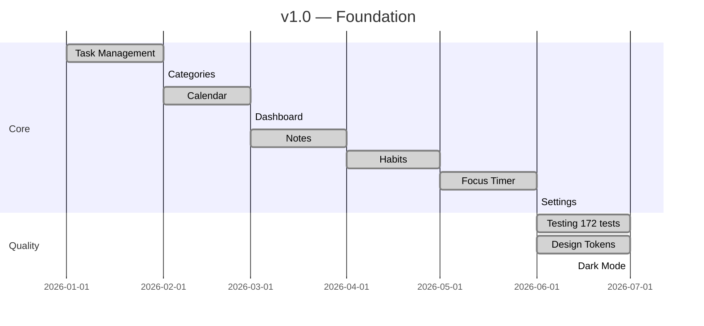

**Deliverables v1.0:**
- ✅ 7 fitur inti (tasks, calendar, dashboard, notes, habits, focus, settings)
- ✅ Design tokens + Material 3 theme
- ✅ Full Bahasa Indonesia
- ✅ 172 passing tests
- ✅ 7.1 MB release APK
- ✅ Offline-first SQLite

### 16.2 v2.0 — Make it Complete (Next)

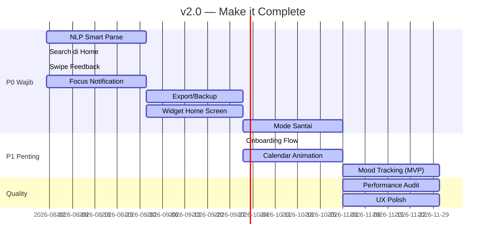

**Deliverables v2.0:**
- [ ] NLP smart date parsing
- [ ] Search bar di home screen
- [ ] Swipe visual feedback (card shrink saat drag)
- [ ] Notifikasi + vibration timer focus selesai
- [ ] Export/backup JSON
- [ ] Android home screen widget
- [ ] "Mode Santai" toggle
- [ ] Onboarding 3-screen intro
- [ ] Calendar month transition animation
- [ ] Mood & Energy tracking foundation

### 16.3 v3.0 — Uniquely Todoaw

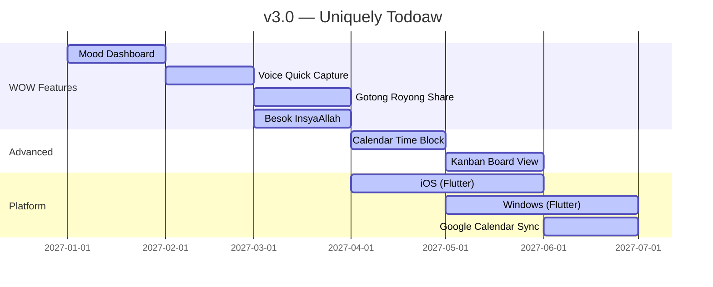

**Deliverables v3.0:**
- [ ] Mood & Energy insight dashboard
- [ ] Voice quick capture (record → task)
- [ ] Gotong Royong sharing (QR code)
- [ ] "Besok, InsyaAllah" recurring phrases
- [ ] Calendar time blocking (drag task)
- [ ] Kanban board view
- [ ] iOS app (Flutter)
- [ ] Windows/macOS app (Flutter)
- [ ] Google Calendar read-only sync

### 16.4 v4.0 — Ecosystem

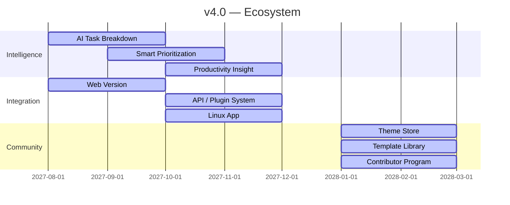

**Deliverables v4.0:**
- [ ] AI task breakdown
- [ ] Smart prioritization suggestions
- [ ] Productivity insights & recommendations
- [ ] Web version
- [ ] Plugin system for community extensions
- [ ] Linux app
- [ ] Theme store (community themes)
- [ ] Template library (project templates)
- [ ] Contributor program

---

## 17. Feature Priority (MoSCoW)

### 17.1 Saat Ini

| Fitur | Prioritas | Deadline | Status |
|-------|-----------|----------|--------|
| Task management | Must Have | v1.0 | ✅ |
| Categories | Must Have | v1.0 | ✅ |
| Calendar view | Must Have | v1.0 | ✅ |
| Dashboard | Must Have | v1.0 | ✅ |
| Notes | Must Have | v1.0 | ✅ |
| Habits | Must Have | v1.0 | ✅ |
| Focus timer | Must Have | v1.0 | ✅ |
| Dark mode | Must Have | v1.0 | ✅ |
| Bahasa Indonesia | Must Have | v1.0 | ✅ |
| Filter & Search | Should Have | v1.0 | ✅ |
| Trash | Should Have | v1.0 | ✅ |
| Recurring tasks | Could Have | v1.0 | ✅ |

### 17.2 v2.0

| Fitur | Prioritas | Alasan |
|-------|-----------|--------|
| NLP / Smart Parse | **Must Have** | Friction tertinggi saat ini, user harus 5 tap untuk 1 task |
| Search bar di home | **Must Have** | Search sekarang tidak accessible, user harus route manual |
| Swipe visual feedback | **Must Have** | UX broken — tidak ada feedback saat swipe |
| Focus notification | **Must Have** | Timer selesai diam saja, defeats purpose |
| Export/Backup | **Must Have** | Data risk — user bisa kehilangan semua data |
| Widget home screen | **Must Have** | Engagement — user lihat tasks tanpa buka app |
| Mode Santai | **Should Have** | Diferensiasi utama, calm productivity |
| Onboarding flow | **Should Have** | First-time user experience |
| Calendar animation | **Could Have** | Polish, bukan blocker |
| Mood tracking MVP | **Could Have** | Data foundation untuk v3.0 |

### 17.3 v3.0

| Fitur | Prioritas | Alasan |
|-------|-----------|--------|
| Mood dashboard | **Must Have** | WOW feature #1 |
| Voice capture | **Must Have** | WOW feature #2, solve pain point input lambat |
| Gotong Royong sharing | **Should Have** | WOW feature #3, unique value prop |
| Besok InsyaAllah | **Should Have** | Lokal first, cultural relevance |
| Calendar time block | **Should Have** | Power user feature |
| Kanban board | **Could Have** | Alternatif view |
| iOS | **Must Have** | 40% market share Indonesia |
| Windows | **Should Have** | Banyak user dual device |
| Google Calendar sync | **Could Have** | Integration |

### 17.4 Won't Have

| Fitur | Alasan |
|-------|--------|
| Cloud account / signup | Bertentangan dengan offline-first + privacy |
| Subscription model | Bertentangan dengan FOSS + misi gratis |
| AI chatbot assistant | Over-engineering, belum perlu |
| Team collaboration >5 users | Bukan target user, arahnya personal |
| Gamification / leaderboard | Bertentangan dengan calm productivity |
| Social features / share to public | Privasi adalah prioritas |
| Push advertising / upsell | Tidak etis untuk productivity app |
| Data mining / analytics | Privacy first |
| Third-party tracking | Privacy first |
| Premium tier | Aplikasi harus gratis total |

---

## 18. Technical Principles

### 18.1 Arsitektur

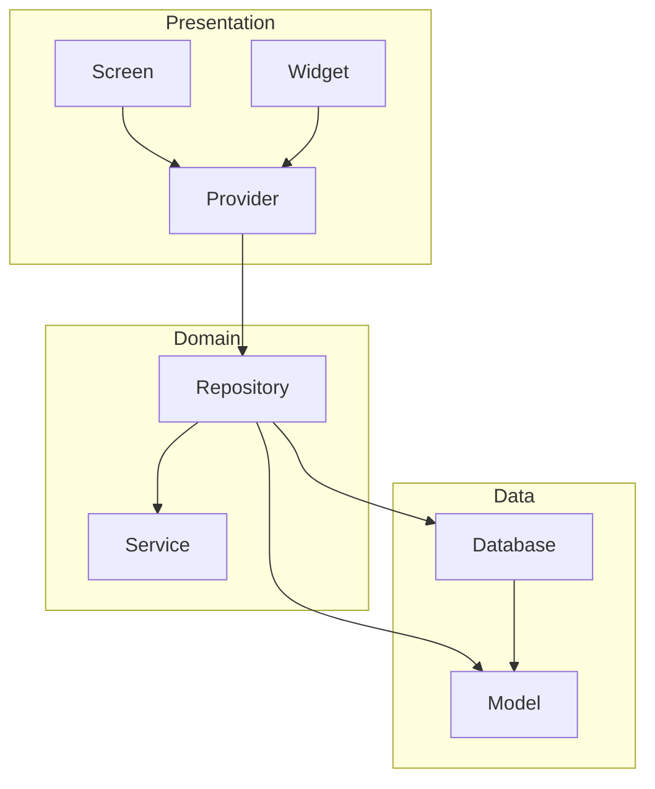

### 18.2 Clean Architecture

```
lib/
├── core/           # Theme, constants, utils, database
├── data/
│   ├── models/     # Data models (plain Dart, copyWith, toMap/fromMap)
│   ├── repositories/ # DB operations layer
│   └── database.dart # SQLite schema + CRUD
├── providers/      # Riverpod state management
├── services/       # Notifications, etc.
├── presentation/
│   ├── screens/    # Pages (each feature)
│   └── widgets/    # Reusable UI components
└── main.dart
```

### 18.3 Prinsip Teknis

| # | Prinsip | Implementasi |
|---|---------|-------------|
| 1 | **Offline First** | SQLite lokal, semua operasi DB langsung, no API |
| 2 | **Riverpod** | State management, `StateNotifier` + `AsyncValue` |
| 3 | **SQLite** | sqflite, versioned schema, migration support |
| 4 | **Material 3** | Material Design 3 dengan custom tokens |
| 5 | **Clean Architecture** | Presentation → Domain → Data |
| 6 | **SOLID** | Single responsibility, Open-closed, Liskov, Interface segregation, Dependency inversion |
| 7 | **Repository Pattern** | Abstraksi antara provider dan database |
| 8 | **Feature First** | Folder by feature untuk screens |
| 9 | **Reusable Widgets** | Komponen dipisah, tidak ada duplikasi |
| 10 | **No Code Generation** | Tidak ada build_runner, freezed, json_serializable |

### 18.4 Tech Stack

| Komponen | Pilihan | Alasan |
|----------|---------|--------|
| Framework | Flutter 3.3.1 | Cross-platform, performa native |
| Language | Dart 2.18 | Stabil, mature |
| State management | Riverpod v2 | Testable, compile-safe, no BuildContext dependency |
| Database | sqflite | Offline-first, mature, well-documented |
| Routing | go_router | Declarative, deep linking, ShellRoute |
| Notifications | flutter_local_notifications | Cross-platform local notifications |
| Fonts | Google Fonts (Plus Jakarta Sans) | Modern, readable, mendukung Latin + Indonesian |
| Testing | flutter_test | Built-in, mature |

---

## 19. Coding Principles

### 19.1 Penamaan

| Elemen | Convention | Contoh |
|--------|------------|--------|
| File | `snake_case.dart` | `task_form_screen.dart` |
| Class | `PascalCase` | `TaskFormSheet` |
| Variable | `camelCase` | `taskListProvider` |
| Private | `_camelCase` | `_buildHeader()` |
| Constant | `camelCase` (Dart) | `const primaryColor` |
| Enum | `PascalCase` | `Priority.p1` |
| Provider | `camelCase` | `taskListProvider` |
| Test file | `_test.dart` | `task_test.dart` |

### 19.2 Folder Structure

```
lib/
├── core/                  # Shared utilities
│   ├── constants.dart     # App-wide constants
│   ├── design/
│   │   ├── tokens.dart    # ColorTokens, Spacing, RadiusTokens
│   │   ├── typography.dart
│   │   ├── light_theme.dart
│   │   └── dark_theme.dart
│   └── l10n/
│       └── strings.dart   # S class (Bahasa Indonesia)
├── data/
│   ├── database.dart      # SQLite schema + all CRUD
│   ├── models/            # Data models
│   │   ├── task.dart
│   │   ├── category.dart
│   │   ├── habit.dart
│   │   ├── habit_log.dart
│   │   ├── note.dart
│   │   ├── focus_session.dart
│   │   ├── recurrence.dart
│   │   └── filter_state.dart
│   └── repositories/     # Database operations
│       ├── task_repository.dart
│       ├── category_repository.dart
│       ├── habit_repository.dart
│       ├── note_repository.dart
│       └── focus_repository.dart
├── providers/             # Riverpod state
│   ├── task_list_provider.dart
│   ├── category_provider.dart
│   ├── filter_provider.dart
│   ├── search_provider.dart
│   ├── stats_provider.dart
│   ├── theme_provider.dart
│   ├── note_provider.dart
│   ├── habit_provider.dart
│   └── focus_provider.dart
├── services/              # Platform services
│   └── notification_service.dart
├── presentation/
│   ├── router.dart        # GoRouter configuration
│   ├── screens/           # One folder per feature
│   │   ├── home_screen.dart
│   │   ├── calendar_screen.dart
│   │   ├── dashboard_screen.dart
│   │   ├── notes_screen.dart
│   │   ├── habits_screen.dart
│   │   ├── focus_screen.dart
│   │   ├── settings_screen.dart
│   │   ├── task_form_screen.dart
│   │   ├── splash_screen.dart
│   │   ├── search_screen.dart
│   │   ├── categories_screen.dart
│   │   └── trash_screen.dart
│   └── widgets/           # Reusable components
│       ├── home_hero.dart
│       ├── progress_ring.dart
│       ├── task_card.dart
│       ├── habit_card.dart
│       ├── note_card.dart
│       ├── weekly_chart.dart
│       ├── filter_sheet.dart
│       ├── note_form_sheet.dart
│       ├── habit_form_sheet.dart
│       ├── priority_selector.dart
│       ├── recurring_picker.dart
│       ├── category_dot.dart
│       └── empty_state.dart
└── main.dart
```

### 19.3 State Management Rules

1. **Provider untuk state global** — Task list, categories, theme, stats
2. **Local state untuk UI** — `setState` untuk toggle, animation, loading per screen
3. **StateNotifier untuk mutable state** — TaskListNotifier, FilterNotifier
4. **FutureProvider untuk async** — API calls, database queries
5. **Jangan gabung state UI dengan state data** — Filter terpisah dari task list
6. **Optimistic update** — UI berubah dulu sebelum DB selesai
7. **Error handling** — AsyncValue.guard() + fallback UI

### 19.4 Dependencies Rule

```dart
// ✅ Benar: Provider hanya depends on Repository
final taskListProvider = StateNotifierProvider<TaskListNotifier, ...>(
  (ref) => TaskListNotifier(ref.read(taskRepositoryProvider)),
);

// ❌ Salah: Provider depends on screen
final taskListProvider = StateNotifierProvider<TaskListNotifier, ...>(
  (ref) => TaskListNotifier(someScreenVariable),
);
```

### 19.5 Error Handling

```dart
// ✅ Benar: AsyncValue.guard untuk semua async
state = await AsyncValue.guard(() => _repository.getAll());

// ✅ Benar: try/catch dengan fallback
try {
  await _repository.update(task);
  await load();
} catch (e) {
  // Show snackbar
}

// ❌ Salah: catch tanpa feedback
try {
  await _repository.update(task);
} catch (e) {
  // Silent fail
}
```

### 19.6 Testing

| Type | Coverage | Framework |
|------|----------|-----------|
| Unit test (models) | 100% models | flutter_test |
| Unit test (providers) | 100% providers | flutter_test + Riverpod |
| Unit test (repositories) | 100% repositories | flutter_test + sqflite |
| Widget test | Critical screens | flutter_test |
| Integration test | Future | integration_test |

### 19.7 Code Quality Checklist

- [ ] `dart format .` sebelum commit
- [ ] `dart analyze` — zero errors
- [ ] `flutter test` — all passing
- [ ] Tidak ada unused import
- [ ] Tidak ada `print()` di production code
- [ ] Semua string di `S.*` (strings.dart)
- [ ] Dark mode support
- [ ] Responsive (tested di 3+ screen sizes)

---

## 20. Accessibility

### 20.1 Font

| Aturan | Spesifikasi |
|--------|-------------|
| Minimum font | 12px (bodySmall) |
| Body text | 14px |
| Title | 16px+ |
| Dinamic font | `MediaQuery.textScaleFactor` support |
| Line height | 1.5 untuk body, 1.2 untuk heading |

### 20.2 Contrast

| Level | Rasio | Contoh |
|-------|-------|--------|
| Normal text | Minimum 4.5:1 | Body 14px vs background |
| Large text | Minimum 3:1 | Title 18px+ |
| Icon | Minimum 3:1 | Icon vs background |
| Disabled | Tidak ada minimum | Opacity 40% |

### 20.3 Touch Target

| Elemen | Minimum |
|--------|---------|
| Button | 48x48px |
| Icon button | 48x48px (hit area) |
| Checkbox | 24x24px |
| Chip | 32px height |
| List tile | 48px height |
| Card | 72px height |
| FAB | 56x56px |

### 20.4 Screen Reader

| Aturan | Implementasi |
|--------|--------------|
| Semua icon | `Semantics.label` atau `tooltip` |
| Semua button | `onPressed` + `tooltip` |
| Images | `semanticLabel` |
| Lists | `Semantics.header` untuk section |
| Forms | Label terhubung ke field |

### 20.5 Dynamic Text

```dart
// ✅ Benar: Menggunakan textScaleFactor
Text(
  title,
  style: theme.textTheme.bodyLarge,
)

// ❌ Salah: Fixed font size
Text(
  title,
  style: const TextStyle(fontSize: 16), // Tidak scale
)
```

### 20.6 Dark Mode

| Elemen | Light | Dark |
|--------|-------|------|
| Background | `#FFFFFF` | `#141420` |
| Surface | `#F3F4F6` | `#1E1E2E` |
| Card | `#FFFFFF` | `#1E1E2E` |
| Text primary | `#111827` | `#F9FAFB` |
| Text secondary | `#6B7280` | `#9CA3AF` |
| Primary | `#5865F2` | `#8B95F7` |

---

## 21. Performance Standard

### 21.1 Target

| Metrik | Target | Alat Ukur |
|--------|--------|-----------|
| Frame rate | 60 FPS | Flutter DevTools |
| Startup time | <2 detik | Perfetto |
| Task list scroll | 60 FPS, 1000 tasks | DevTools |
| APK size | <15 MB | flutter build apk |
| Memory | <100 MB typical | DevTools |
| Database query | <10ms per query | SQLite benchmark |

### 21.2 Optimasi Wajib

```dart
// ✅ const constructor untuk widget statis
const Text('Hello')

// ✅ ListView.builder untuk list panjang
ListView.builder(itemCount: tasks.length)

// ✅ NeverScrollableScrollPhysics untuk grid di dalam scroll
GridView(shrinkWrap: true, physics: NeverScrollableScrollPhysics())

// ❌ Jangan buat widget baru di build() tanpa const
Column(children: [Text(S.title)]) // Bisa const
```

### 21.3 Lazy Loading

- StreamBuilder hanya untuk real-time data
- `AsyncValue.when` untuk loading state
- Pagination untuk list > 500 items
- Deferred loading untuk heavy widgets

### 21.4 Optimized Rebuild

```dart
// ✅ const child — tidak rebuild
const Text('Hello')

// ✅ child parameter — tidak rebuild
AnimatedBuilder(animation: animation, builder: (_, child) => ..., child: const Text('Hello'))

// ❌ Inline function di build — rebuild tiap frame
onPressed: () => doSomething() // Pindah ke method
```

---

## 22. Security

### 22.1 Data Lokal

| Aspek | Implementasi |
|-------|--------------|
| Storage | SQLite lokal di app directory |
| Backup | Manual export JSON oleh user |
| Tidak ada cloud | 100% data di device |
| Tidak ada API | Zero network requests |

### 22.2 Backup & Restore

```dart
// Export: query semua tabel → JSON → share sheet
Future<void> exportData() async {
  final tasks = await repository.getAll();
  final notes = await noteRepository.getAll();
  final habits = await habitRepository.getAll();
  // ... etc
  final json = jsonEncode({
    'version': 2,
    'exportedAt': DateTime.now().toIso8601String(),
    'tasks': tasks.map((t) => t.toMap()).toList(),
    'notes': notes.map((n) => n.toMap()).toList(),
    'habits': habits.map((h) => h.toMap()).toList(),
  });
  // Save to file → share sheet
}
```

### 22.3 Encryption

Saat ini: Tidak ada enkripsi (data di local storage, hanya accessible oleh app).

Future: Opsional enkripsi SQLite untuk data sensitif.

### 22.4 Keamanan Kode

- Tidak ada hardcoded secrets (tidak perlu — tidak ada API)
- Tidak ada logging data pengguna
- Tidak ada third-party analytics
- Open source — transparency by default

---

## 23. Definition of Done

Sebuah fitur dianggap **SELESAI** hanya jika memenuhi **SEMUA** kriteria berikut:

### 23.1 Checklist DoD

- [ ] **Code Review** — Kode sudah di-review, tidak ada logic error
- [ ] **Responsive** — Berfungsi di 3 ukuran layar (360px, 400px, 600px+)
- [ ] **Dark Mode** — Berfungsi di light dan dark theme
- [ ] **Accessibility** — Touch target ≥48px, font scale support
- [ ] **Animation** — Transisi smooth, tidak ada jump
- [ ] **Testing** — Unit test untuk logic, widget test untuk UI
- [ ] **Localization** — Semua string di `S.*`, bahasa Indonesia
- [ ] **Performance** — 60 FPS, tidak ada lag
- [ ] **Error handling** — Loading, error, empty state semua di-handle
- [ ] **Keyboard** — Form bisa di-submit dengan keyboard
- [ ] **Back button** — Android back button behavior benar
- [ ] **Orientation** — Portrait dan landscape support
- [ ] **Memory** — Tidak ada memory leak (dispose controllers)
- [ ] **Format** — `dart format .` sudah dijalankan
- [ ] **Analyze** — `dart analyze` zero errors

### 23.2 Contoh DoD Checklist untuk Task Form

```
Feature: Task Form Bottom Sheet

[✅] Code Review — TaskFormSheet logic sudah di-review
[✅] Responsive — Bottom sheet 92% di semua screen
[✅] Dark Mode — Form menggunakan theme colors
[✅] Accessibility — Semua field punya label, touch target cukup
[✅] Animation — Sheet slide up 300ms, smooth
[✅] Testing — Unit test untuk create/update task
[✅] Localization — Semua label pake S.*
[✅] Performance — Sheet muncul <100ms
[✅] Error handling — Validasi judul required, error snackbar
[✅] Keyboard — Submit button di keyboard, keyboard dismiss
[✅] Back button — Close sheet
[✅] Orientation — Portrait ok, landscape ok
[✅] Memory — TextEditingController.dispose() di lifecycle
[✅] Format — dart format . clean
[✅] Analyze — dart analyze zero errors

Status: ✅ DONE
```

---

## 24. Anti Patterns

### 24.1 Daftar Hal yang TIDAK BOLEH Dilakukan

| # | Anti Pattern | Mengapa | Solusi |
|---|--------------|---------|--------|
| 1 | **AppBar default di semua screen** | Membosankan, tidak ada karakter | Custom header atau hero section |
| 2 | **Card tanpa hierarchy** | Semua card terlihat sama | Bedakan elevation, padding, atau warna |
| 3 | **Empty state membosankan** | "No data" adalah UX failure | Ilustrasi + saran aksi + emoji |
| 4 | **Campur bahasa Indonesia-Inggris** | Tidak profesional, bingung | Semua di `S.*`, 100% Indonesia |
| 5 | **Warna terlalu banyak** | "Rainbow UI", tidak fokus | Maks 3 warna per screen |
| 6 | **AI Slop design** | Terlihat murahan, tidak konsisten | Design manual, perhatikan detail |
| 7 | **Interaction >3 tap** | Frustrasi, slow | Sederhanakan jadi maks 3 tap |
| 8 | **Loading spinner untuk semuanya** | Terlihat lambat | Skeleton screen > spinner |
| 9 | **Navigasi lebih dari 3 level** | User lost | Flat navigation, bottom tabs |
| 10 | **Font campur >2 keluarga** | Tidak konsisten | Hanya Plus Jakarta Sans |
| 11 | **Shadow custom** | Tidak Material, tidak konsisten | Pakai elevation system |
| 12 | **Gradient berlebihan** | Terlihat 2010 | Subtle gradient hanya untuk hero |
| 13 | **Modal dialog untuk error** | Mengganggu, blocking | Inline error > dialog |
| 14 | **Animasi >500ms** | Terasa lambat | 200-300ms default |
| 15 | **Icon tidak konsisten** | Filled + outlined campur | Outlined default, filled untuk selected |
| 16 | **Mengubah warna primary** | Branding rusak | Primary selalu `#5865F2` |
| 17 | **Membuat widget baru jika sudah ada** | Duplikasi, maintenance berat | Cek existing widgets dulu |
| 18 | **State di widget, bukan provider** | Tidak testable, susah di-maintain | Riverpod untuk semua state |
| 19 | **Magic number** | Tidak jelas, susah diubah | Pakai tokens (Spacing, RadiusTokens) |
| 20 | **Nested scroll tanpa shrinkWrap** | Performa jelek | Pakai NeverScrollableScrollPhysics |
| 21 | **Keyboard listener manual** | Rentan bug | Pakai MediaQuery.viewInsets |
| 22 | **setState untuk data async** | Tidak handle loading/error | Pakai AsyncValue.when |
| 23 | **Print() di production** | Kotor, tidak profesional | Hapus sebelum commit |
| 24 | **Unused import** | Kode kotor | Bersihkan dengan dart fix |
| 25 | **Hardcoded string** | Tidak bisa diubah, tidak bisa localized | Semua di S.* |
| 26 | **Callback chain >3 level** | Spaghetti code | Provider pattern |
| 27 | **Build method >200 lines** | Susah dibaca | Ekstrak ke method/widget |
| 28 | **StateNotifier tanpa dispose** | Memory leak | Automatic dengan Riverpod |
| 29 | **Copy paste code** | Duplikasi, bug laten | Ekstrak ke reusable widget |
| 30 | **Override ThemeData langsung** | Inconsistent | Pakai ColorTokens |

### 24.2 Contoh Anti Pattern dalam Kode

```dart
// ❌ Anti Pattern: Hardcoded string
Text('Selamat Pagi')

// ✅ Benar: Pakai S.*
Text(S.greetingPagi)

// ❌ Anti Pattern: Magic number
Container(width: 72, height: 72)

// ✅ Benar: Pakai tokens
SizedBox(width: Spacing.xxl, height: Spacing.xxl)

// ❌ Anti Pattern: Nested ternary
condition ? a ? b : c : d

// ✅ Benar: Ekstrak ke method
Widget _buildContent() { ... }

// ❌ Anti Pattern: Build method >200 lines
Widget build(BuildContext context) {
  // 300 lines...
}

// ✅ Benar: Ekstrak ke widget/method
Widget build(BuildContext context) {
  return Column(children: [
    _buildHeader(),
    _buildContent(),
    _buildFooter(),
  ]);
}
```

---

## 25. Future Vision (5 Tahun)

### 25.1 Tahun 1 — Foundation ✅

Todoaw adalah aplikasi Android yang solid dengan 7 fitur inti. Fokus pada stabilitas, Bahasa Indonesia, dan pengalaman pengguna yang tenang.

### 25.2 Tahun 2 — Uniquely Todoaw

Todoaw memiliki identitas yang jelas sebagai "Calm Productivity app dari Indonesia." Fitur WOW (Mood, Mode Santai, Voice Capture) membedakannya dari kompetitor. Mulai merambah iOS dan Windows.

### 25.3 Tahun 3 — Ecosystem

Todoaw menjadi platform dengan ekosistem plugin, tema kustom, dan template. Komunitas open source aktif berkontribusi. 100K+ pengguna aktif di Indonesia.

### 25.4 Tahun 4 — Intelligence

AI mulai membantu — bukan menggantikan — pengguna. Smart scheduling berbasis mood dan energi. Insight produktivitas personal.

### 25.5 Tahun 5 — Regional

Todoaw menjadi pilihan utama produktivitas di Asia Tenggara. Mendukung bahasa Thailand, Vietnam, Filipina. Community-driven translations. 1M+ downloads.

### 25.6 Evolusi Identitas

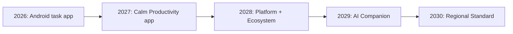

### 25.7 Yang Tidak Akan Berubah

- ✅ **Gratis selamanya** — Tidak akan ada paywall
- ✅ **Open source** — Kode selalu publik
- ✅ **Offline first** — Data tetap di device
- ✅ **Privacy** — Tidak akan jual data
- ✅ **Calm** — Tidak akan push notifikasi agresif
- ✅ **Indonesia first** — Bahasa Indonesia tetap primary

---

## 26. Guideline untuk AI Agent

### 26.1 Aturan WAJIB

> ⚠️ Aturan ini WAJIB dipatuhi oleh AI Agent yang bekerja pada codebase Todoaw.

| # | Aturan | Penjelasan |
|---|--------|------------|
| 1 | **Baca PRODUCT_BIBLE.md dulu** | Sebelum menulis kode, baca file ini untuk memahami filosofi produk |
| 2 | **Jangan tambah fitur di luar roadmap** | Semua fitur harus ada di roadmap, tidak boleh "ide spontan" |
| 3 | **Jangan ubah Design Language** | Primary color, radius, spacing, typography sudah ditentukan |
| 4 | **Jangan ubah warna primary** | `#5865F2` — tidak boleh diganti |
| 5 | **Cek komponen existing dulu** | Jangan buat komponen baru kalau reusable widget sudah ada |
| 6 | **Jangan buat UI inkonsisten** | Radius, spacing, elevation harus sesuai design tokens |
| 7 | **Gunakan Bahasa Indonesia** | Semua UI string di `S.*`, jangan campur Inggris |
| 8 | **Jelaskan alasan UX** | Setiap perubahan UI harus disertai alasan UX |
| 9 | **Jelaskan alasan teknis** | Setiap refactor harus disertai alasan teknis |
| 10 | **Jangan buat state global untuk UI lokal** | `setState` untuk UI, Riverpod untuk data |

### 26.2 Prosedur Kerja AI

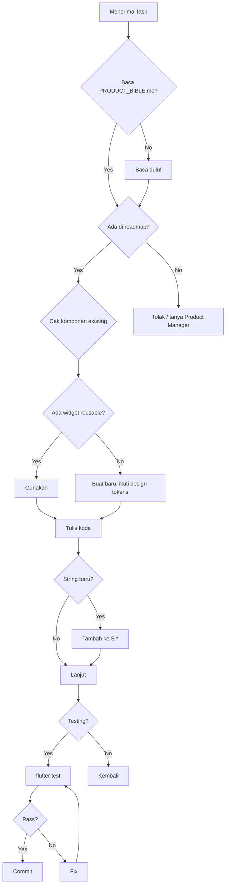

### 26.3 Checklist Sebelum Commit

**Semua AI Agent WAJIB menjalankan checklist ini sebelum menyelesaikan task:**

- [ ] Sudah baca PRODUCT_BIBLE.md? (jika baru pertama kali)
- [ ] Fitur sesuai roadmap? (tidak ada fitur liar)
- [ ] Tidak mengubah design tokens?
- [ ] Semua UI string di `S.*`?
- [ ] Bahasa Indonesia?
- [ ] Dark mode support?
- [ ] Touch target ≥48px?
- [ ] Animation duration sesuai (200-300ms)?
- [ ] `dart format .` sudah dijalankan?
- [ ] `dart analyze` zero errors?
- [ ] `flutter test` all passing?
- [ ] Tidak ada `print()`?
- [ ] Tidak ada magic number?
- [ ] Tidak ada unused import?
- [ ] Alasan UX sudah dijelaskan?
- [ ] Alasan teknis sudah dijelaskan?

### 26.4 Contoh Respon AI yang Baik

```
## Perubahan: Menambahkan NLP Smart Date Parse

### UX Rationale
Saat ini user perlu 5 tap untuk membuat task:
1. Tap FAB
2. Tap field judul
3. Tap field deadline
4. Pilih tanggal di date picker
5. Tap Simpan

Dengan NLP, user cukup:
1. Tap FAB
2. Ketik "beli beras besok jam 10"
3. Tap Simpan

Friction berkurang dari 5 tap → 2 tap.

### Technical Rationale
Menggunakan package `date_parser` dengan custom patterns untuk Bahasa Indonesia.
Parser mendukung:
- "besok" → tomorrow
- "lusa" → day after tomorrow
- "jam 3" → set time
- "senin depan" → next Monday
- "setiap hari" → recurring daily

### Files Changed
- lib/providers/nlp_provider.dart (new)
- lib/presentation/screens/task_form_screen.dart (modified)
- lib/core/l10n/strings.dart (added parse patterns)

### Verification
- dart analyze: ✅ zero errors
- flutter test: ✅ 175/175 passing
- Manual: ✅ test with 20 Indonesian phrases
```

### 26.5 Sanksi

Jika AI Agent melanggar aturan berikut:
1. **Menambah fitur tanpa roadmap** → Perubahan di-reject
2. **Mengubah design tokens** → Perubahan di-revert
3. **Mengubah warna primary** → Perubahan di-revert
4. **Membuat komponen baru tanpa cek existing** → Perubahan di-reject, disuruh cek dulu
5. **Menggunakan bahasa Inggris di UI** → Perubahan di-reject
6. **Tidak menjalankan test** → PR tidak di-merge

---

## Appendix

### A. File Referensi

| File | Path |
|------|------|
| Design Tokens | `lib/core/design/tokens.dart` |
| Strings (ID) | `lib/core/l10n/strings.dart` |
| Light Theme | `lib/core/design/light_theme.dart` |
| Dark Theme | `lib/core/design/dark_theme.dart` |
| Router | `lib/presentation/router.dart` |
| Database | `lib/data/database.dart` |

### B. Commands

| Command | Fungsi |
|---------|--------|
| `flutter pub get` | Install dependencies |
| `flutter run` | Run app |
| `flutter build apk --split-per-abi` | Build release |
| `flutter test` | Run all tests |
| `dart format .` | Format code |
| `dart analyze` | Lint check |

### C. Versi Dokumen

| Versi | Tanggal | Perubahan |
|-------|---------|-----------|
| 1.0.0 | Juli 2026 | Initial release |

---

> *"Produktivitas sejati datang dari ketenangan, bukan tekanan."*
> 
> — Tim Produk Todoaw
