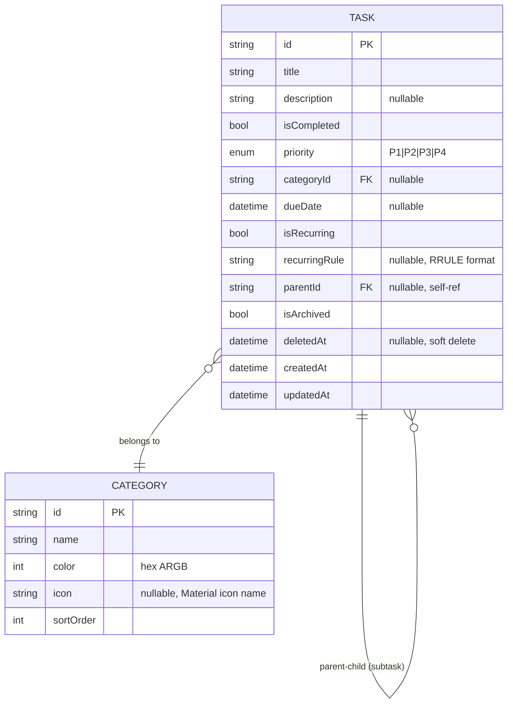

# PRD — todoaw

## Objective
A full-featured offline-first todo app built with Flutter, inspired by TickTick/Todoist but lightweight & local-only.

## Target User
Individual productivity users who want a fast, private, no-account todo app.

---

## Features

### MVP (M1-M2)
- Task CRUD (title, description, status)
- Subtasks (unlimited nesting, max 2 levels)
- Priority: P1 (Urgent), P2 (High), P3 (Medium), P4 (Low)
- Categories with color & icon
- Due dates with date picker
- Swipe to complete/delete

### Advanced (M3-M4)
- Recurring tasks (daily/weekly/monthly/custom RRULE)
- Calendar view (monthly grid)
- Local notifications for due tasks
- Full-text search
- Filter by status/priority/category/date range
- Archive & trash (soft delete, 30-day auto-purge)

### Polish (M5-M6)
- Statistics dashboard (completion rate, streak, trends)
- Dark mode
- Animations (hero, list, transitions)
- App icon & splash screen

---

## Data Model

### ERD



### Task Fields Detail

| Field | Type | Required | Default | Notes |
|---|---|---|---|---|
| id | String (UUID) | Y | auto | Primary key, generated by Isar |
| title | String | Y | — | Max 500 chars |
| description | String? | N | null | Rich text optional |
| isCompleted | bool | Y | false | |
| priority | Priority enum | Y | P3 | P1=Urgent, P2=High, P3=Medium, P4=Low |
| categoryId | String? | N | null | Foreign key to Category |
| dueDate | DateTime? | N | null | |
| isRecurring | bool | Y | false | |
| recurringRule | String? | N | null | RRULE subset format |
| parentId | String? | N | null | Self-referencing FK for subtasks |
| isArchived | bool | Y | false | |
| deletedAt | DateTime? | N | null | Soft delete timestamp |
| createdAt | DateTime | Y | auto | |
| updatedAt | DateTime | Y | auto | |

### Category Fields Detail

| Field | Type | Required | Default | Notes |
|---|---|---|---|---|
| id | String (UUID) | Y | auto | |
| name | String | Y | — | Unique, max 50 chars |
| color | int | Y | 0xFF5B67CA | ARGB hex |
| icon | String? | N | null | Material icon name |
| sortOrder | int | Y | 0 | Display ordering |

### Constraints

| Entity | Constraint | Rule |
|---|---|---|
| Task | title | Required, max 500 chars |
| Task | parentId | Max nesting depth: 2 levels |
| Task | recurringRule | Only valid if `isRecurring == true` |
| Task | deletedAt | If set, task hidden from main list; visible in Trash |
| Task | dueDate | Cannot be in past on creation (warning only) |
| Category | name | Required, unique, max 50 chars |
| Category | color | Required, default `0xFF5B67CA` |

### Recurring Rule Format (RRULE subset)

```dart
// Examples:
"FREQ=DAILY"                    // every day
"FREQ=WEEKLY;BYDAY=MO,WE,FR"   // Mon, Wed, Fri
"FREQ=WEEKLY;INTERVAL=2"       // every 2 weeks
"FREQ=MONTHLY;BYMONTHDAY=15"   // every 15th
"FREQ=YEARLY"                   // every year same date
```

---

## Route Tree (go_router)

```dart
GoRouter(
  initialLocation: '/',
  routes: [
    StatefulShellRoute.indexedStack(
      branches: [
        // Tab 0: Home
        StatefulShellBranch(
          routes: [
            GoRoute(path: '/', builder: (_, __) => HomeScreen),
          ],
        ),
        // Tab 1: Calendar
        StatefulShellBranch(
          routes: [
            GoRoute(path: '/calendar', builder: (_, __) => CalendarScreen),
          ],
        ),
        // Tab 2: Stats
        StatefulShellBranch(
          routes: [
            GoRoute(path: '/stats', builder: (_, __) => StatsScreen),
          ],
        ),
        // Tab 3: Settings
        StatefulShellBranch(
          routes: [
            GoRoute(path: '/settings', builder: (_, __) => SettingsScreen),
          ],
        ),
      ],
    ),
    GoRoute(path: '/task/new', builder: (_, __) => TaskFormScreen),
    GoRoute(path: '/task/:id', builder: (_, state) => TaskFormScreen(id: state.pathParameters['id'])),
    GoRoute(path: '/search', builder: (_, __) => SearchScreen),
    GoRoute(path: '/trash', builder: (_, __) => TrashScreen),
  ],
)
```

## UI Design Tokens

### Colors

| Token | Light | Dark | Usage |
|---|---|---|---|
| primary | `#5B67CA` | `#7C85D6` | App bar, FAB, buttons |
| secondary | `#43C6AC` | `#5DD4B8` | Accents, badges |
| surface | `#FFFFFF` | `#2D2E42` | Cards, sheets |
| background | `#F5F7FA` | `#1A1B2F` | Screen bg |
| error | `#EF4444` | `#F87171` | Delete, errors |
| onSurface | `#1F2937` | `#E5E7EB` | Primary text |
| onSurfaceVariant | `#6B7280` | `#9CA3AF` | Secondary text |

### Priority Colors

| Priority | Color |
|---|---|
| P1 — Urgent | `#EF4444` (Red) |
| P2 — High | `#F59E0B` (Amber) |
| P3 — Medium | `#3B82F6` (Blue) |
| P4 — Low | `#9CA3AF` (Gray) |

### Typography

| Style | Weight | Size | Height |
|---|---|---|---|
| Heading | w600 | 20 | 1.4 |
| Subheading | w600 | 16 | 1.4 |
| Body | w400 | 14 | 1.5 |
| Caption | w400 | 12 | 1.4 |
| Button | w600 | 14 | 1.2 |

### Spacing & Layout

| Token | Value |
|---|---|
| Base grid | 4px |
| Content padding | 16px |
| Card rounding | 12px |
| Button rounding | 8px |
| Sheet rounding | 24px (top only) |
| Bottom nav height | 64px |
| FAB size | 56px |
| Max content width | 480px (centered) |

---

## Non-Functional Requirements

- Offline-first, no internet required
- Startup time < 2s on mid-range device
- APK size < 15MB (release build)
- Min Android SDK: 21 (5.0)
- Target Android SDK: 34
- iOS target: 13.0
- Crash rate < 0.1%
