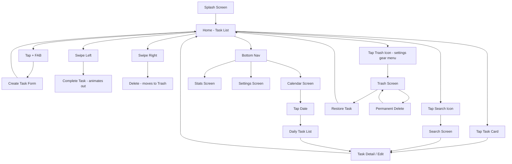

# Screens & User Flow — todoaw

---

## User Flow Diagram



---

## Screen Wireframes

### 1. Home Screen

```
┌──────────────────────────────┐
│  StatusBar: Todoaw            │
│ ┌──────────────────────────┐ │
│ │ 🔍                  ⚙️  │ │
│ └──────────────────────────┘ │
│                              │
│  📅 Today — 3 tasks          │
│ ┌──────────────────────────┐ │
│ │ 🔲 [•] Design home page  │ │
│ │     📎 P2  📅 Today      │ │
│ ├──────────────────────────┤ │
│ │ 🔲 [•] Setup Riverpod   │ │
│ │     📎 P1  📅 Today      │ │
│ ├──────────────────────────┤ │
│ │ ☑️ [✓] Create project    │ │
│ │     📎 P3  📅 Today  ~~~ │ │
│ └──────────────────────────┘ │
│                              │
│  📅 Tomorrow — 1 task        │
│ ┌──────────────────────────┐ │
│ │ 🔲 [•] Write tests      │ │
│ │     📎 P4               │ │
│ └──────────────────────────┘ │
│                              │
│  📅 Upcoming — 2 tasks       │
│ ┌──────────────────────────┐ │
│ │ 🔲 [•] Deploy v1.0      │ │
│ │     📎 P2  📅 Jul 25    │ │
│ └──────────────────────────┘ │
│                              │
│       [🏠] [📅] [📊] [⚙️]   │
└──────────────────────────────┘
      ◎       ◎       ◎

Legend:
🔲 = unchecked  ☑️ = checked
[•] = category dot (colored)
📎 = priority badge
📅 = due date
~~~ = strikethrough (completed)
```

### 2. Create/Edit Task Screen

```
┌──────────────────────────────┐
│  ← Cancel    New Task    ✓   │
│                              │
│ ┌──────────────────────────┐ │
│ │ Title                    │ │
│ │ ──────────────────────── │ │
│ │ Buy groceries            │ │
│ └──────────────────────────┘ │
│                              │
│ ┌──────────────────────────┐ │
│ │ Description (optional)   │ │
│ │ ──────────────────────── │ │
│ │ Milk, eggs, bread        │ │
│ │                          │ │
│ └──────────────────────────┘ │
│                              │
│ Priority                     │
│ [P1] [P2] [P3] [P4]         │
│         ● selected           │
│                              │
│ Category                     │
│ ┌──────────────────────────┐ │
│ │ 🛒 Personal          >  │ │
│ └──────────────────────────┘ │
│                              │
│ Due Date                     │
│ ┌──────────────────────────┐ │
│ │ Mon, Jul 21, 2026    >  │ │
│ └──────────────────────────┘ │
│                              │
│ Repeat                       │
│ ┌──────────────────────────┐ │
│ │ Every Week            >  │ │
│ └──────────────────────────┘ │
│                              │
│ ┌──────────────────────────┐ │
│ │        Delete Task       │ │
│ └──────────────────────────┘ │
└──────────────────────────────┘
```

### 3. Calendar Screen

```
┌──────────────────────────────┐
│  ← July 2026           >    │
│                              │
│  Mo  Tu  We  Th  Fr  Sa  Su  │
│          1    2    3    4   5 │
│              ●               │
│   6    7    8    9   10  11 12 │
│   ●              ●           │
│  13   14   15   16   17  18 19 │
│                             ● │
│  20  [21]  22   23   24  25 26 │
│      ●●●  ●                   │
│  27   28   29   30   31       │
│                              │
│ ───────────────────────────── │
│  📅 Mon, Jul 21, 2026        │
│                              │
│ ┌──────────────────────────┐ │
│ │ 🔲 Buy groceries     P2 │ │
│ │     🛒 Personal          │ │
│ ├──────────────────────────┤ │
│ │ 🔲 Call dentist      P1 │ │
│ │     🏥 Health            │ │
│ ├──────────────────────────┤ │
│ │ ☑️ Submit report     P3 │ │
│ │     💼 Work              │ │
│ └──────────────────────────┘ │
│                              │
│       [🏠] [📅] [📊] [⚙️]   │
└──────────────────────────────┘
      ◎       ◎       ◎

● = dot indicator: has tasks on that date
[21] = selected date (highlighted)
●●● = multiple dots = multiple categories
```

### 4. Search Screen

```
┌──────────────────────────────┐
│  ←             🔍            │
│ ┌──────────────────────────┐ │
│ │ Search tasks...          │ │
│ └──────────────────────────┘ │
│                              │
│ Filters:                     │
│ [All] [Active] [Completed]   │
│ [P1] [P2] [P3] [P4]         │
│ Category: [All ▼]           │
│                              │
│ ✨ 3 results for "grocer"    │
│                              │
│ ┌──────────────────────────┐ │
│ │ 🔲 Buy **grocer**ies     │ │
│ │     📎 P2  📅 Today      │ │
│ ├──────────────────────────┤ │
│ │ 🔲 **Grocer**y list      │ │
│ │     📎 P3  📅 Tomorrow   │ │
│ └──────────────────────────┘ │
│                              │
│       [🏠] [📅] [📊] [⚙️]   │
└──────────────────────────────┘
```

### 5. Stats Screen

```
┌──────────────────────────────┐
│  ← Statistics                │
│                              │
│  🔥 Streak                    │
│  ┌────────────────────────┐  │
│  │      12 days           │  │
│  └────────────────────────┘  │
│                              │
│  📊 Completion Rate           │
│  ┌────────────────────────┐  │
│  │     ┌────┐             │  │
│  │     │78% │             │  │
│  │     │    │    ┌────┐   │  │
│  │     │    │    │22% │   │  │
│  │     └────┘    └────┘   │  │
│  │   Completed   Pending   │  │
│  └────────────────────────┘  │
│                              │
│  📈 Last 7 Days              │
│  ┌────────────────────────┐  │
│  │  ██                     │  │
│  │  ██ ██                  │  │
│  │  ██ ██    ██            │  │
│  │  ██ ██ ██ ██ ██ ██ ██  │  │
│  │  M  T  W  T  F  S  S   │  │
│  └────────────────────────┘  │
│                              │
│       [🏠] [📅] [📊] [⚙️]   │
└──────────────────────────────┘
```

### 6. Settings Screen

```
┌──────────────────────────────┐
│  ← Settings                  │
│                              │
│  APPEARANCE                  │
│ ┌──────────────────────────┐ │
│ │ 🌙 Dark Mode     [OFF]  │ │
│ └──────────────────────────┘ │
│ ┌──────────────────────────┐ │
│ │ 🎨 Theme Color    >     │ │
│ └──────────────────────────┘ │
│                              │
│  NOTIFICATIONS               │
│ ┌──────────────────────────┐ │
│ │ 🔔 Reminders      [ON]  │ │
│ └──────────────────────────┘ │
│ ┌──────────────────────────┐ │
│ │ ⏰ Default remind time   │ │
│ │     30 min before    >  │ │
│ └──────────────────────────┘ │
│                              │
│  DATA                        │
│ ┌──────────────────────────┐ │
│ │ 🗑️ Trash         3 items│ │
│ └──────────────────────────┘ │
│ ┌──────────────────────────┐ │
│ │ 📤 Export data       >  │ │
│ └──────────────────────────┘ │
│                              │
│  ABOUT                       │
│ ┌──────────────────────────┐ │
│ │ ℹ️ Version 1.0.0        │ │
│ └──────────────────────────┘ │
│                              │
│       [🏠] [📅] [📊] [⚙️]   │
└──────────────────────────────┘
```

### 7. Trash Screen

```
┌──────────────────────────────┐
│  ← Trash          Empty All  │
│                              │
│  Tasks in trash for 30 days  │
│  before permanent deletion   │
│                              │
│ ┌──────────────────────────┐ │
│ │ 🔲 Buy groceries     ↩️  │ │
│ │     Deleted 2h ago       │ │
│ ├──────────────────────────┤ │
│ │ 🔲 Call dentist      ↩️  │ │
│ │     Deleted 3d ago       │ │
│ ├──────────────────────────┤ │
│ │ 🔲 Old note          ↩️  │ │
│ │     Deleted 25d ago  ⚠️  │ │
│ └──────────────────────────┘ │
│                              │
│       [🏠] [📅] [📊] [⚙️]   │
└──────────────────────────────┘

↩️ = restore button (per item)
⚠️ = near auto-purge (within 5 days)
```

### 8. Recurring Task Config (Bottom Sheet)

```
┌──────────────────────────────┐
│ ┌──────────────────────────┐ │
│ │    Repeat              │ │
│ │                         │ │
│ │ ○ Never                 │ │
│ │ ● Every Day             │ │
│ │ ○ Every Weekday         │ │
│ │ ○ Every Week            │ │
│ │ ○ Every Month           │ │
│ │ ○ Every Year            │ │
│ │ ○ Custom... >           │ │
│ │                         │ │
│ │     [Cancel] [Apply]    │ │
│ └──────────────────────────┘ │
└──────────────────────────────┘

Custom sheet:
┌──────────────────────────────┐
│ ┌──────────────────────────┐ │
│ │    Custom Repeat       │ │
│ │                         │ │
│ │ Repeat every [1] [Week] │ │
│ │                         │ │
│ │ On: [Mon] [Tue] [Wed]   │ │
│ │     [Thu] [Fri] [Sat]   │ │
│ │     [Sun]               │ │
│ │                         │ │
│ │ Ends: ○ Never           │ │
│ │       ○ After [10]      │ │
│ │       ○ On [Date]       │ │
│ │                         │ │
│ │     [Cancel] [Apply]    │ │
│ └──────────────────────────┘ │
└──────────────────────────────┘
```

---

## Navigation Map

```
Home (/) ──┬── FAB (+) → TaskForm (/task/new)
           ├── Tap card → TaskForm (/task/:id)
           ├── Swipe L  → Complete (inline)
           ├── Swipe R  → Delete → Trash
           ├── Search   → SearchScreen (/search)
           └── Tab bar
                ├── Calendar (/calendar) → Tap date → daily view
                ├── Stats (/stats)
                └── Settings (/settings) → Trash (/trash)
```

## Gesture Map

| Gesture | Action | Feedback |
|---|---|---|
| Swipe left | Complete task | Green check overlay, haptic |
| Swipe right | Delete task | Red trash overlay, haptic, undo snackbar |
| Tap FAB | New task | Scale animation |
| Tap checkbox | Toggle complete | Checkmark animation |
| Long-press task | Multi-select mode (future) | Selection highlight |
| Pull down on list | Refresh | Spinner |
| Tap category dot | Filter by category | Chip highlight |
