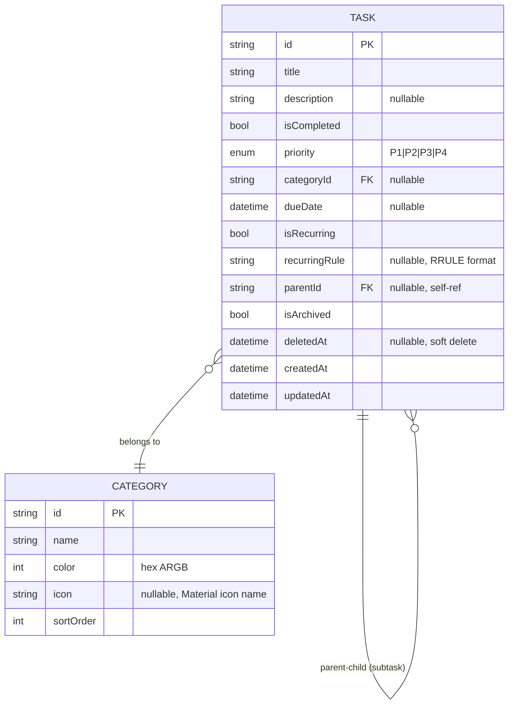
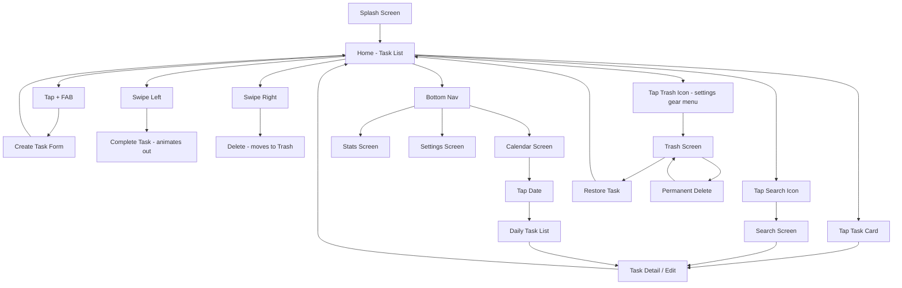

# todoaw — Flutter Todo App

Dokumentasi lengkap proyek todoaw, menggabungkan AGENTS.md, PRD.md, PLAN.md, dan SCREENS.md.

---

## Daftar Isi

1. [Konvensi & Tech Stack](#1-konvensi--tech-stack)
2. [Product Requirements](#2-product-requirements)
3. [Execution Plan](#3-execution-plan)
4. [Screen Wireframes](#4-screen-wireframes)

---

## 1. Konvensi & Tech Stack

> Sumber: `AGENTS.md`

### Tech Stack

| Layer | Teknologi |
|-------|-----------|
| **Framework** | Flutter 3.x (Dart 2.18) |
| **State Management** | Riverpod (v2) — StateNotifier + AsyncValue |
| **Local Database** | sqflite (SQLite) |
| **Routing** | go_router (v6, ShellRoute) |
| **Notifications** | flutter_local_notifications |

### Project Structure

```
lib/
├── core/           # theme, constants, utils, database
├── models/         # Data models (plain Dart)
├── providers/      # Riverpod providers
├── repositories/   # DB operations layer
├── services/       # Notifications, etc.
├── screens/        # Pages (Home, Calendar, Stats, Settings)
├── widgets/        # Reusable UI components
└── main.dart
```

### Conventions

- Plain Dart models with `copyWith` & `toMap`/`fromMap` serialization
- Riverpod `StateNotifier` + `AsyncValue` pattern
- Folder-by-feature for screens
- All business logic in providers/repositories, not in widgets
- Use `dart format` before commits

### Commands

| Command | Description |
|---------|-------------|
| `flutter pub get` | Install dependencies |
| `flutter run` | Run app |
| `flutter build apk --release` | Build release APK |
| `flutter build apk --release --split-per-abi` | Build split APK (~7MB) |
| `flutter test` | Run tests |
| `dart format .` | Format code |
| `dart analyze` | Lint check |

---

## 2. Product Requirements

> Sumber: `docs/PRD.md`

### Objective

A full-featured offline-first todo app built with Flutter, inspired by TickTick/Todoist but lightweight & local-only.

### Target User

Individual productivity users who want a fast, private, no-account todo app.

### Features

#### MVP (M1-M2)
- Task CRUD (title, description, status)
- Subtasks (unlimited nesting, max 2 levels)
- Priority: P1 (Urgent), P2 (High), P3 (Medium), P4 (Low)
- Categories with color & icon
- Due dates with date picker
- Swipe to complete/delete

#### Advanced (M3-M4)
- Recurring tasks (daily/weekly/monthly/custom RRULE)
- Calendar view (monthly grid)
- Local notifications for due tasks
- Full-text search
- Filter by status/priority/category/date range
- Archive & trash (soft delete, 30-day auto-purge)

#### Polish (M5-M6)
- Statistics dashboard (completion rate, streak, trends)
- Dark mode
- Animations (hero, list, transitions)
- App icon & splash screen

### Data Model

#### ERD



#### Task Fields

| Field | Type | Required | Default | Notes |
|-------|------|----------|---------|-------|
| id | String (UUID) | Y | auto | Primary key |
| title | String | Y | — | Max 500 chars |
| description | String? | N | null | Rich text optional |
| isCompleted | bool | Y | false | |
| priority | Priority enum | Y | P3 | P1=Urgent, P2=High, P3=Medium, P4=Low |
| categoryId | String? | N | null | Foreign key to Category |
| dueDate | DateTime? | N | null | |
| isRecurring | bool | Y | false | |
| recurringRule | String? | N | null | RRULE subset format |
| parentId | String? | N | null | Self-referencing FK for subtasks |
| isArchived | bool | Y | false | |
| deletedAt | DateTime? | N | null | Soft delete timestamp |
| createdAt | DateTime | Y | auto | |
| updatedAt | DateTime | Y | auto | |

#### Category Fields

| Field | Type | Required | Default | Notes |
|-------|------|----------|---------|-------|
| id | String (UUID) | Y | auto | |
| name | String | Y | — | Unique, max 50 chars |
| color | int | Y | 0xFF5B67CA | ARGB hex |
| icon | String? | N | null | Material icon name |
| sortOrder | int | Y | 0 | Display ordering |

#### Constraints

| Entity | Constraint | Rule |
|--------|-----------|------|
| Task | title | Required, max 500 chars |
| Task | parentId | Max nesting depth: 2 levels |
| Task | recurringRule | Only valid if `isRecurring == true` |
| Task | deletedAt | If set, task hidden from main list; visible in Trash |
| Task | dueDate | Cannot be in past on creation (warning only) |
| Category | name | Required, unique, max 50 chars |
| Category | color | Required, default `0xFF5B67CA` |

#### Recurring Rule Format (RRULE subset)

```dart
"FREQ=DAILY"                    // every day
"FREQ=WEEKLY;BYDAY=MO,WE,FR"   // Mon, Wed, Fri
"FREQ=WEEKLY;INTERVAL=2"       // every 2 weeks
"FREQ=MONTHLY;BYMONTHDAY=15"   // every 15th
"FREQ=YEARLY"                   // every year same date
```

### Route Tree

```dart
GoRouter(
  initialLocation: '/splash',
  routes: [
    GoRoute(path: '/splash', builder: SplashScreen),
    ShellRoute(
      builder: ScaffoldWithNavBar,
      routes: [
        GoRoute(path: '/',          builder: HomeScreen),
        GoRoute(path: '/calendar',  builder: CalendarScreen),
        GoRoute(path: '/stats',     builder: StatsScreen),
        GoRoute(path: '/settings',  builder: SettingsScreen),
      ],
    ),
    GoRoute(path: '/task/new',     builder: TaskFormScreen),
    GoRoute(path: '/task/:id',     builder: TaskFormScreen),
    GoRoute(path: '/search',       builder: SearchScreen),
    GoRoute(path: '/trash',        builder: TrashScreen),
    GoRoute(path: '/categories',   builder: CategoriesScreen),
  ],
)
```

### UI Design Tokens

#### Colors

| Token | Light | Dark | Usage |
|-------|-------|------|-------|
| primary | `#5B67CA` | `#7C85D6` | App bar, FAB, buttons |
| secondary | `#43C6AC` | `#5DD4B8` | Accents, badges |
| surface | `#FFFFFF` | `#2D2E42` | Cards, sheets |
| background | `#F5F7FA` | `#1A1B2F` | Screen bg |
| error | `#EF4444` | `#F87171` | Delete, errors |
| onSurface | `#1F2937` | `#E5E7EB` | Primary text |
| onSurfaceVariant | `#6B7280` | `#9CA3AF` | Secondary text |

#### Priority Colors

| Priority | Color |
|----------|-------|
| P1 — Urgent | `#EF4444` (Red) |
| P2 — High | `#F59E0B` (Amber) |
| P3 — Medium | `#3B82F6` (Blue) |
| P4 — Low | `#9CA3AF` (Gray) |

#### Typography

| Style | Weight | Size | Height |
|-------|--------|------|--------|
| Heading | w600 | 20 | 1.4 |
| Subheading | w600 | 16 | 1.4 |
| Body | w400 | 14 | 1.5 |
| Caption | w400 | 12 | 1.4 |
| Button | w600 | 14 | 1.2 |

#### Spacing & Layout

| Token | Value |
|-------|-------|
| Base grid | 4px |
| Content padding | 16px |
| Card rounding | 12px |
| Button rounding | 8px |
| Sheet rounding | 24px (top only) |
| Bottom nav height | 64px |
| FAB size | 56px |
| Max content width | 480px (centered) |

### Non-Functional Requirements

- Offline-first, no internet required
- Startup time < 2s on mid-range device
- APK size < 15MB (release build, split-per-abi: ~7MB)
- Min Android SDK: 21 (5.0)
- Target Android SDK: 34
- iOS target: 13.0
- Crash rate < 0.1%

---

## 3. Execution Plan

> Sumber: `docs/PLAN.md`

### Milestone Overview

| Milestone | Focus | Progress |
|-----------|-------|----------|
| **M1** | Foundation | ✅ 7/7 |
| **M2** | Core Features | ✅ 12/12 |
| **M3** | Time Features | ✅ 9/9 |
| **M4** | Smart Features | ✅ 7/7 |
| **M5** | Polish | ✅ 8/8 |
| **M6** | Release | ⬜ 8/12 |

### M1 — Foundation (✅ Selesai)

- [x] `flutter create todoaw`
- [x] Setup folder structure
- [x] Add dependencies (riverpod, sqflite, go_router, flutter_local_notifications)
- [x] Configure theme system
- [x] Setup go_router with ShellRoute + 4 bottom tabs
- [x] Create SQLite schema: Task and Category models
- [x] Create base repository pattern

### M2 — Core Features (✅ Selesai)

- [x] Home screen: task list grouped by date (Today/Tomorrow/Upcoming)
- [x] Section headers per date group
- [x] Task card widget (checkbox, category dot, title, priority badge, due date)
- [x] Create task screen
- [x] Edit task screen
- [x] Task detail screen with subtask list
- [x] Add subtask from task detail (max 2 levels)
- [x] Priority selector widget
- [x] Category CRUD screen
- [x] Swipe to complete (left) and delete (right)
- [x] Empty state widget
- [x] Due date display on task cards ("Today", "Tomorrow", "MMM d")

### M3 — Time Features (✅ Selesai)

- [x] Date picker widget
- [x] Recurring task screen (frequency picker)
- [x] Recurring task logic: generate next instance on completion
- [x] Calendar screen: monthly grid, dots on dates with tasks
- [x] Tap date on calendar → show daily task list
- [x] Notification service setup
- [x] Schedule local notification on task save (due date - 30min)
- [x] Cancel/reschedule notification on task update/delete

### M4 — Smart Features (✅ Selesai)

- [x] Full-text search bar (debounced 300ms)
- [x] Search results display
- [x] Filter bottom sheet: status, priority, category
- [x] Filter chips on home screen
- [x] Archive task
- [x] Trash screen: list deleted tasks
- [x] Restore from trash
- [x] Permanent delete with confirmation dialog
- [x] Auto-purge trash (30 days)

### M5 — Polish (✅ Selesai)

- [x] Stats screen: completion rate (pie chart)
- [x] Streak counter
- [x] Tasks completed per day (bar chart, last 7 days)
- [x] Dark mode toggle in settings
- [x] List animations: staggered fade-in
- [x] Hero transitions: task card → detail screen
- [x] Splash screen (Dart widget, 2 detik)
- [x] Category dot warna sesuai kategori (fix)

### M6 — Release (⬜ 8/12)

- [x] Unit tests: models (48 tests)
- [x] Unit tests: repositories (28 tests)
- [x] Unit tests: providers (25 tests)
- [x] Unit tests: services (24 tests)
- [x] Widget tests (screen-level) — home, task_form, calendar, search
- [x] `dart analyze` — zero warnings
- [x] `dart format .` — clean formatting
- [x] Build APK release (arm64-v8a: 7.1MB)
- [ ] Integration tests (3 critical flows, needs device)
- [ ] Build AAB for Play Store
- [ ] Play Store listing assets

### Testing Strategy

| Layer | Type | Tools | Target Coverage |
|-------|------|-------|-----------------|
| Models | Unit | `flutter_test` | 100% |
| Repositories | Unit | `flutter_test` + sqflite_ffi | 90%+ |
| Providers | Unit | riverpod test utilities | 90%+ |
| Screens | Widget | `flutter_test` + `ProviderScope` | 80%+ |
| Services | Unit | `flutter_test` + mocktail | 90%+ |
| Integration | Integration | `integration_test` | 3 critical flows |

### Test File Structure

```
test/
├── models/
│   ├── task_test.dart
│   ├── category_test.dart
│   ├── filter_state_test.dart
│   └── recurrence_test.dart
├── repositories/
│   ├── task_repository_test.dart
│   └── category_repository_test.dart
├── providers/
│   ├── task_list_provider_test.dart
│   ├── category_provider_test.dart
│   ├── filter_provider_test.dart
│   ├── search_provider_test.dart
│   ├── stats_provider_test.dart
│   └── theme_provider_test.dart
├── screens/
│   ├── home_screen_test.dart
│   ├── task_form_screen_test.dart
│   ├── calendar_screen_test.dart
│   └── search_screen_test.dart
├── services/
│   ├── notification_service_test.dart
│   └── recurring_task_service_test.dart
├── integration/
│   └── critical_flows_test.dart (not yet written)
└── test_helpers.dart
```

### Release Criteria

| Criteria | Target | Status |
|----------|--------|--------|
| Min SDK | Android 5.0 (API 21) | ✅ compileSdk 34, minSdk 21 |
| Target SDK | Android 34 | ✅ |
| APK size | < 15 MB | ✅ arm64-v8a: 7.1MB |
| App startup | < 2s | ✅ |
| Test pass | 100% | ✅ 141/141 |
| Lint | 0 warnings | ✅ |
| Format | clean | ✅ |

---

## 4. Screen Wireframes

> Sumber: `docs/SCREENS.md`

### User Flow Diagram



### 1. Home Screen

```
┌──────────────────────────────┐
│  StatusBar: Todoaw            │
│ ┌──────────────────────────┐ │
│ │ 🔍                  ⚙️  │ │
│ └──────────────────────────┘ │
│                              │
│  📅 Today — 3 tasks          │
│ ┌──────────────────────────┐ │
│ │ 🔲 [•] Design home page  │ │
│ │     📎 P2  📅 Today      │ │
│ ├──────────────────────────┤ │
│ │ 🔲 [•] Setup Riverpod   │ │
│ │     📎 P1  📅 Today      │ │
│ ├──────────────────────────┤ │
│ │ ☑️ [✓] Create project    │ │
│ │     📎 P3  📅 Today  ~~~ │ │
│ └──────────────────────────┘ │
│                              │
│  📅 Tomorrow — 1 task        │
│ ┌──────────────────────────┐ │
│ │ 🔲 [•] Write tests      │ │
│ │     📎 P4               │ │
│ └──────────────────────────┘ │
│                              │
│  📅 Upcoming — 2 tasks       │
│ ┌──────────────────────────┐ │
│ │ 🔲 [•] Deploy v1.0      │ │
│ │     📎 P2  📅 Jul 25    │ │
│ └──────────────────────────┘ │
│                              │
│       [🏠] [📅] [📊] [⚙️]   │
└──────────────────────────────┘
      ◎       ◎       ◎

Legend:
🔲 = unchecked  ☑️ = checked
[•] = category dot (colored)
📎 = priority badge
📅 = due date
~~~ = strikethrough (completed)
```

### 2. Create/Edit Task Screen

```
┌──────────────────────────────┐
│  ← Cancel    New Task    ✓   │
│                              │
│ ┌──────────────────────────┐ │
│ │ Title                    │ │
│ │ ──────────────────────── │ │
│ │ Buy groceries            │ │
│ └──────────────────────────┘ │
│                              │
│ ┌──────────────────────────┐ │
│ │ Description (optional)   │ │
│ │ ──────────────────────── │ │
│ │ Milk, eggs, bread        │ │
│ │                          │ │
│ └──────────────────────────┘ │
│                              │
│ Priority                     │
│ [P1] [P2] [P3] [P4]         │
│         ● selected           │
│                              │
│ Category                     │
│ ┌──────────────────────────┐ │
│ │ 🛒 Personal          >  │ │
│ └──────────────────────────┘ │
│                              │
│ Due Date                     │
│ ┌──────────────────────────┐ │
│ │ Mon, Jul 21, 2026    >  │ │
│ └──────────────────────────┘ │
│                              │
│ Repeat                       │
│ ┌──────────────────────────┐ │
│ │ Every Week            >  │ │
│ └──────────────────────────┘ │
│                              │
│ ┌──────────────────────────┐ │
│ │        Delete Task       │ │
│ └──────────────────────────┘ │
└──────────────────────────────┘
```

### 3. Calendar Screen

```
┌──────────────────────────────┐
│  ← July 2026           >    │
│                              │
│  Mo  Tu  We  Th  Fr  Sa  Su  │
│          1    2    3    4   5 │
│              ●               │
│   6    7    8    9   10  11 12 │
│   ●              ●           │
│  13   14   15   16   17  18 19 │
│                             ● │
│  20  [21]  22   23   24  25 26 │
│      ●●●  ●                   │
│  27   28   29   30   31       │
│                              │
│ ───────────────────────────── │
│  📅 Mon, Jul 21, 2026        │
│                              │
│ ┌──────────────────────────┐ │
│ │ 🔲 Buy groceries     P2 │ │
│ │     🛒 Personal          │ │
│ ├──────────────────────────┤ │
│ │ 🔲 Call dentist      P1 │ │
│ │     🏥 Health            │ │
│ ├──────────────────────────┤ │
│ │ ☑️ Submit report     P3 │ │
│ │     💼 Work              │ │
│ └──────────────────────────┘ │
│                              │
│       [🏠] [📅] [📊] [⚙️]   │
└──────────────────────────────┘
      ◎       ◎       ◎

● = dot indicator: has tasks on that date
[21] = selected date (highlighted)
●●● = multiple dots = multiple categories
```

### 4. Search Screen

```
┌──────────────────────────────┐
│  ←             🔍            │
│ ┌──────────────────────────┐ │
│ │ Search tasks...          │ │
│ └──────────────────────────┘ │
│                              │
│ Filters:                     │
│ [All] [Active] [Completed]   │
│ [P1] [P2] [P3] [P4]         │
│ Category: [All ▼]           │
│                              │
│ ✨ 3 results for "grocer"    │
│                              │
│ ┌──────────────────────────┐ │
│ │ 🔲 Buy **grocer**ies     │ │
│ │     📎 P2  📅 Today      │ │
│ ├──────────────────────────┤ │
│ │ 🔲 **Grocer**y list      │ │
│ │     📎 P3  📅 Tomorrow   │ │
│ └──────────────────────────┘ │
│                              │
│       [🏠] [📅] [📊] [⚙️]   │
└──────────────────────────────┘
```

### 5. Stats Screen

```
┌──────────────────────────────┐
│  ← Statistics                │
│                              │
│  🔥 Streak                    │
│  ┌────────────────────────┐  │
│  │      12 days           │  │
│  └────────────────────────┘  │
│                              │
│  📊 Completion Rate           │
│  ┌────────────────────────┐  │
│  │     ┌────┐             │  │
│  │     │78% │             │  │
│  │     │    │    ┌────┐   │  │
│  │     │    │    │22% │   │  │
│  │     └────┘    └────┘   │  │
│  │   Completed   Pending   │  │
│  └────────────────────────┘  │
│                              │
│  📈 Last 7 Days              │
│  ┌────────────────────────┐  │
│  │  ██                     │  │
│  │  ██ ██                  │  │
│  │  ██ ██    ██            │  │
│  │  ██ ██ ██ ██ ██ ██ ██  │  │
│  │  M  T  W  T  F  S  S   │  │
│  └────────────────────────┘  │
│                              │
│       [🏠] [📅] [📊] [⚙️]   │
└──────────────────────────────┘
```

### 6. Settings Screen

```
┌──────────────────────────────┐
│  ← Settings                  │
│                              │
│  APPEARANCE                  │
│ ┌──────────────────────────┐ │
│ │ 🌙 Dark Mode     [OFF]  │ │
│ └──────────────────────────┘ │
│ ┌──────────────────────────┐ │
│ │ 🎨 Theme Color    >     │ │
│ └──────────────────────────┘ │
│                              │
│  NOTIFICATIONS               │
│ ┌──────────────────────────┐ │
│ │ 🔔 Reminders      [ON]  │ │
│ └──────────────────────────┘ │
│ ┌──────────────────────────┐ │
│ │ ⏰ Default remind time   │ │
│ │     30 min before    >  │ │
│ └──────────────────────────┘ │
│                              │
│  DATA                        │
│ ┌──────────────────────────┐ │
│ │ 🗑️ Trash         3 items│ │
│ └──────────────────────────┘ │
│ ┌──────────────────────────┐ │
│ │ 📤 Export data       >  │ │
│ └──────────────────────────┘ │
│                              │
│  ABOUT                       │
│ ┌──────────────────────────┐ │
│ │ ℹ️ Version 1.0.0        │ │
│ └──────────────────────────┘ │
│                              │
│       [🏠] [📅] [📊] [⚙️]   │
└──────────────────────────────┘
```

### 7. Trash Screen

```
┌──────────────────────────────┐
│  ← Trash          Empty All  │
│                              │
│  Tasks in trash for 30 days  │
│  before permanent deletion   │
│                              │
│ ┌──────────────────────────┐ │
│ │ 🔲 Buy groceries     ↩️  │ │
│ │     Deleted 2h ago       │ │
│ ├──────────────────────────┤ │
│ │ 🔲 Call dentist      ↩️  │ │
│ │     Deleted 3d ago       │ │
│ ├──────────────────────────┤ │
│ │ 🔲 Old note          ↩️  │ │
│ │     Deleted 25d ago  ⚠️  │ │
│ └──────────────────────────┘ │
│                              │
│       [🏠] [📅] [📊] [⚙️]   │
└──────────────────────────────┘

↩️ = restore button (per item)
⚠️ = near auto-purge (within 5 days)
```

### 8. Recurring Task Config (Bottom Sheet)

```
┌──────────────────────────────┐
│ ┌──────────────────────────┐ │
│ │    Repeat              │ │
│ │                         │ │
│ │ ○ Never                 │ │
│ │ ● Every Day             │ │
│ │ ○ Every Weekday         │ │
│ │ ○ Every Week            │ │
│ │ ○ Every Month           │ │
│ │ ○ Every Year            │ │
│ │ ○ Custom... >           │ │
│ │                         │ │
│ │     [Cancel] [Apply]    │ │
│ └──────────────────────────┘ │
└──────────────────────────────┘

Custom sheet:
┌──────────────────────────────┐
│ ┌──────────────────────────┐ │
│ │    Custom Repeat       │ │
│ │                         │ │
│ │ Repeat every [1] [Week] │ │
│ │                         │ │
│ │ On: [Mon] [Tue] [Wed]   │ │
│ │     [Thu] [Fri] [Sat]   │ │
│ │     [Sun]               │ │
│ │                         │ │
│ │ Ends: ○ Never           │ │
│ │       ○ After [10]      │ │
│ │       ○ On [Date]       │ │
│ │                         │ │
│ │     [Cancel] [Apply]    │ │
│ └──────────────────────────┘ │
└──────────────────────────────┘
```

### Navigation Map

```
Home (/) ──┬── FAB (+) → TaskForm (/task/new)
           ├── Tap card → TaskForm (/task/:id)
           ├── Swipe L  → Complete (inline)
           ├── Swipe R  → Delete → Trash
           ├── Search   → SearchScreen (/search)
           └── Tab bar
                ├── Calendar (/calendar) → Tap date → daily view
                ├── Stats (/stats)
                └── Settings (/settings) → Trash (/trash), Categories (/categories)
```

### Gesture Map

| Gesture | Action | Feedback |
|---------|--------|----------|
| Swipe left | Complete task | Green check overlay |
| Swipe right | Delete task | Red trash overlay |
| Tap FAB | New task | Scale animation |
| Tap checkbox | Toggle complete | Checkmark animation |
| Tap task card | Open task detail | Hero transition |
| Pull down on list | Refresh | Spinner |

---

*Dokumentasi ini digenerate dari AGENTS.md, PRD.md, PLAN.md, dan SCREENS.md — todoaw v1.0.0*
